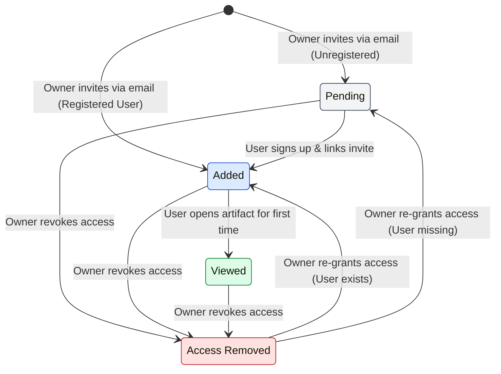

# Artifact Invitation States

This diagram illustrates the lifecycle of an artifact invitation, tracking the transition between states from initial invitation to active viewing and eventual revocation.

### State Definitions

| State | Description | Backend Criteria |
|-------|-------------|------------------|
| **Pending** | User has been invited but has not yet created an account. | `userId` is null, `userInviteId` is present. |
| **Added** | User has an account and access, but hasn't viewed the artifact yet. | `userId` is present, `firstViewedAt` is null. |
| **Viewed** | User has opened the artifact at least once. | `userId` is present, `firstViewedAt` is not null. |
| **Removed** | Access has been revoked (soft-deleted). | `isDeleted` is true. |

### Technical Implementation

- **View Tracking**: The `Viewed` state is triggered by the `useViewTracker` hook on the frontend, which calls the `api.views.record` mutation.
- **Invite Linking**: When a user signs up, the `createOrUpdateUser` callback in `app/convex/auth.ts` calls `linkInvitesToUserInternal` to transfer `Pending` invites to the new `userId`, transitioning them to `Added`.
- **Soft Delete**: Revocation is handled via the `api.access.revoke` mutation, which sets `isDeleted: true` rather than deleting the record, allowing for an audit trail and easy restoration.
