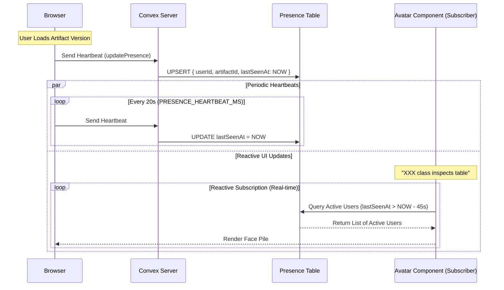
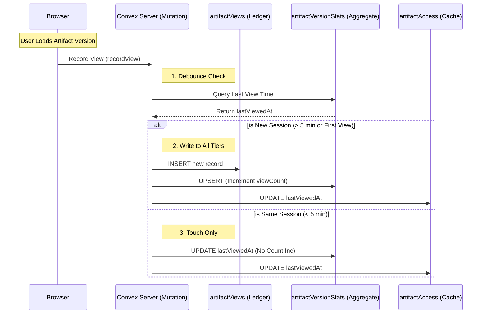
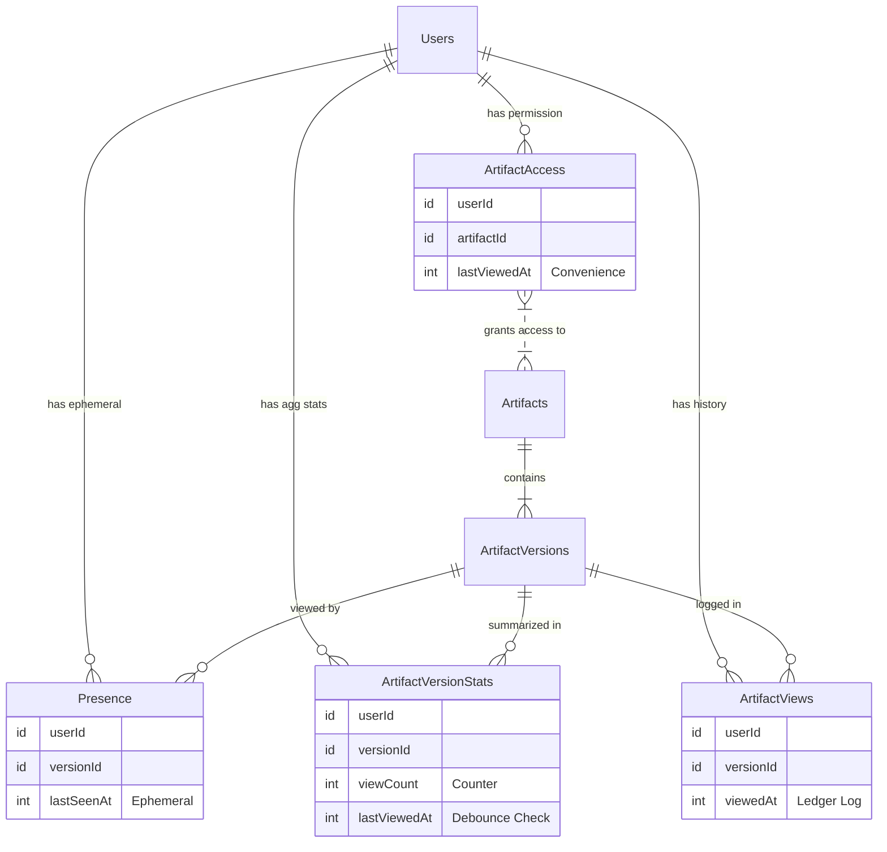

# Architecture: Artifact Views & Presence Tracking

## Overview
This system provides real-time "who is online" indicators (Presence) and persistent historical analytics (View Tracking) for artifacts. Ideally, it separates ephemeral "live" data from long-term "ledger" data to optimize performance and storage.

## Core Concepts

1.  **Presence (Ephemeral)**: "Is User X viewing Artifact Y *right now*?"
    *   **Goal**: Drive UI "face piles" and collision detection.
    *   **Retention**: Very short (minutes).
    *   **Write Frequency**: High (Heartbeats).

2.  **View Tracking (Persistent)**: "Did User X see v2 of Artifact Y?"
    *   **Goal**: Audit trails, unread indicators, and engagement stats.
    *   **Retention**: Permanent.
    *   **Write Frequency**: Medium (Debounced sessions).

---

## 1. Presence System (Live)

The presence system uses a client-side heartbeat loop to keep a record "fresh" in the database.

### Data Flow

### Configuration Parameters
These values tune the responsiveness vs. database load.

| Variable | Current Value | Description | Impact of Changing |
| :--- | :--- | :--- | :--- |
| `PRESENCE_HEARTBEAT_MS` | **60,000** (1m) | How often the browser pings the server. | **Lower**: More real-time precision, higher DB write costs. **Higher**: Laggy "online" status, lower costs. |
| `PRESENCE_TTL_MS` | **150,000** (2.5m) | Time before server considers a user "offline". *(Usually 2.5x the Heartbeat interval)*. | **Lower**: Users flicker "offline" if network hiccups. **Higher**: Users stay "online" long after closing tab. |
| `PRESENCE_CLEANUP_CRON` | `"0 * * * *"` | Cron schedule string (Every hour). | **Frequency**: How often garbage collection runs. |
| `PRESENCE_DATA_RETENTION_MS` | **600,000** (10m) | Age at which presence records are hard-deleted. | Defines the maximum "recently active" window we can query before data is gone. |

---

## 2. View Tracking System (Persistent)

The view tracking system implements a "3-Tier" model to balance write performance with read efficiency.

### 3-Tier Model

1.  **Ledger (`artifactViews`)**: An append-only log of every distinct viewing session. (Source of Truth).
2.  **Aggregate (`artifactVersionStats`)**: A specialized table for fast "User vs. Version" matrix queries. (Read Optimization).
3.  **Permissions (`artifactAccess`)**: A convenience timestamp (`lastViewedAt`) on the access record itself. (Quick Access).

### Logic Flow (Sequence)

### Configuration Parameters

| Variable | Current Value | Description | Impact of Changing |
| :--- | :--- | :--- | :--- |
| `VIEW_DEBOUNCE_MS` | **3,600,000** (1h) | Minimum time between "distinct" view counts. | **Lower**: Inflates view counts if user refreshes often. **Higher**: Consolidates separate short visits into one "session". |

> **Key Concept: Rolling Window**
> The view logic uses a **Rolling Window**. A new view is only counted if the user has been inactive for *at least* `VIEW_DEBOUNCE_MS`.
> *   **Scenario**: User visits at 9:00, then again at 9:45, then again at 10:30.
> *   **Result**: 1 View. Each visit extends the "active session" and resets the timer because the gap (< 1h) never exceeded the threshold.
> *   **Benefit**: Accurately tracks "engagement sessions" rather than just page loads.

---

## 3. Schema Reference

### Information Architecture (All Tables)

