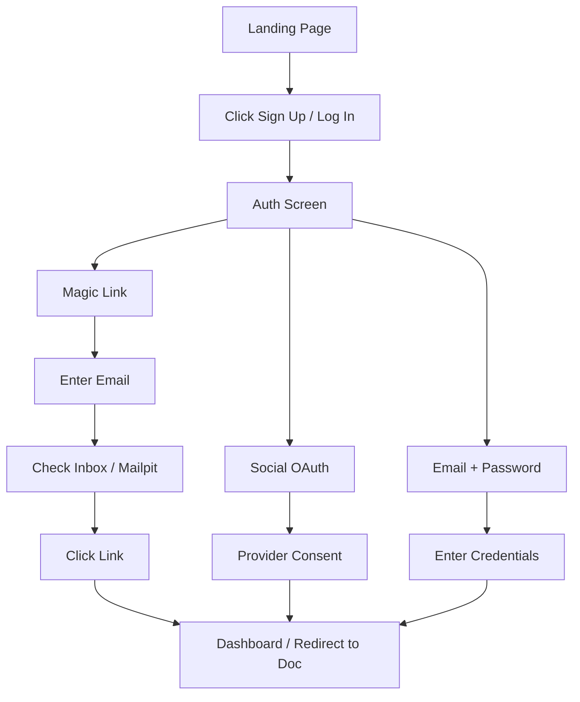

# 001 Signup & Login Journey (Hybrid: Actual + Proposed)

**Persona:** Document Creator / Reviewer
**Goal:** Access the platform using a preferred authentication method

## Overview
Authentication is the entry point for both creators and reviewers. The app supports multiple ways to sign in to minimize friction.

## Auth Options

| Priority | Method | Use Case |
|----------|--------|----------|
| 1 | Magic Link | Quick signup, no password needed |
| 2 | Social (Google, GitHub) | **(Proposed)** One-click access via existing accounts |
| 3 | Email + Password | Traditional login |

## Flow

## Screens

| Step | Screen | Notes |
|------|--------|-------|
| 1 | Landing Page | Clear CTA for login/signup |
| 2 | Auth Form | Toggle between Password and Magic Link; Social buttons |
| 3 | Verification | "Check Your Email" screen for Magic Link |
| 4 | Dashboard | Default land for creators |

## Feature Alignment (E2E Test)
Matches `app/tests/e2e/auth.spec.ts`.

## Status & Actual State
- **Magic Link:** Implemented using Convex & Resend/Mailpit.
- **Password:** Implemented.
- **Google/GitHub:** (Proposed) Logic configured via Convex Auth, but not fully active.
