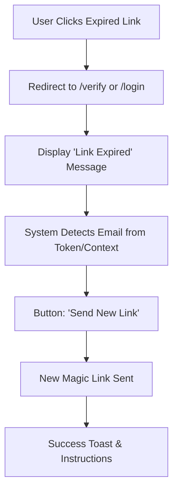

# Journey 001.01: Expired Magic Link Recovery (Proposed)

**Status:** Proposed  
**Persona:** All Users  
**Goal:** Handle the scenario where a user clicks a magic link that is stale or expired, providing a clear path to request a new one.

## Overview
Magic links are time-sensitive (typically 10-15 minutes). If a user waits too long, they need a clear error message and a one-click way to restart the process without having to manually navigate back to the login page and re-type their email.

## Flow

## User Experience Details

### 1. The Error State
When the auth library rejects the token, the user is landed on a dedicated error screen or a section of the login page.
- **Message:** "This link has expired or has already been used."
- **Help Text:** "For your security, sign-in links are only valid for a short time."

### 2. Auto-Recovery
- If the expired link contains metadata about the target email, the system should pre-fill it.
- **CTA:** `Resend Magic Link to [email]`
- This reduces friction by eliminating the need to re-type the email.

### 3. Redirection Preservation
- The system MUST preserve the original `returnTo` parameter during this recovery loop so the user doesn't lose their place (e.g., they were trying to verify their email to share a specific artifact).

## Testing Strategy (No-Wait)
- **Synthetic Error:** Navigate to `/?code=INVALID` in Playwright to trigger the UI error immediately.
- **Database Expiration:** For a full lifecycle test, use the `test_utils:expireLatestMagicLink` mutation after an email is sent. This back-dates the `expirationTime` in the `authVerificationCodes` table, allowing a real link to "fail" as expired.
- **Verifying Recovery:** Affirm the 'Resend' button appears after failure and successfully triggers a new `signIn("resend", ...)` call.

## Technical Considerations
- **Token States:** Distinguish between `expired`, `malformed`, and `already_used` tokens if possible.
- **Rate Limiting:** Ensure the "Resend" button has basic throttle protection to prevent mail bombing.
- **URL Persistence:** Pass the `email` and `returnTo` as query params to the error page.
