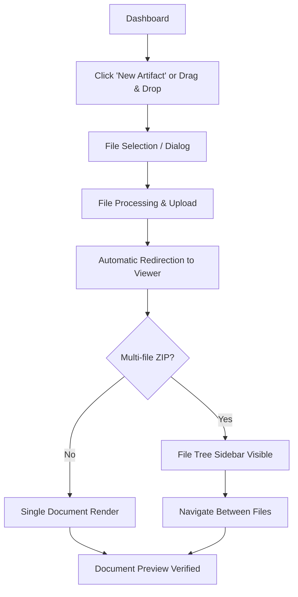

# 002 Artifact Upload & View Journey

**Persona:** Document Creator
**Goal:** Upload an HTML or ZIP document and verify its rendering

## Overview
This journey covers the process of bringing an AI-generated artifact into the platform and ensuring it displays correctly before sharing with stakeholders.

## Flow

## Screens

| Step | Screen | Notes |
|------|--------|-------|
| 1 | Dashboard | Upload zone prominent; empty state shows CTA |
| 2 | Create Artifact Modal | Name the artifact; select file(s) |
| 3 | Upload Progress | Real-time status of file processing |
| 4 | Document Viewer | Full render of HTML/Markdown; File tree for ZIPs |

## Feature Alignment (E2E Test)
Matches `app/tests/e2e/artifact-workflow.spec.ts` (Steps 2 & 3).

## Status & Actual State
- **Single HTML:** Fully supported.
- **ZIP Upload:** Fully supported with automatic unpacking.
- **File Tree:** Fully supported for ZIP artifacts.
- **Markdown:** Supported with preview rendering.
