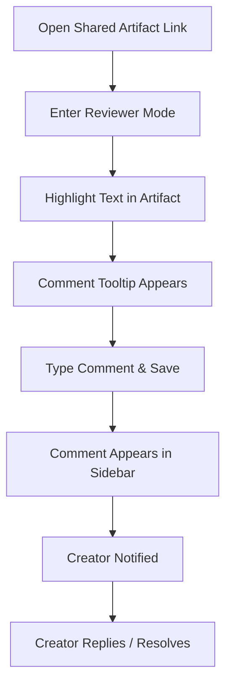

# 003 Reviewer Comments & Feedback Journey

**Persona:** Document Reviewer
**Goal:** Provide specific, contextual feedback on an artifact

## Overview
The core value of Artifact Review is contextual feedback. Reviewers can highlight text in the original artifact and leave comments that sync in real-time.

## Flow

## Screens

| Step | Screen | Notes |
|------|--------|-------|
| 1 | Document View | Reviewer sees the doc as if it was a live page |
| 2 | Selection | Highlighting text triggers the 'Comment' action |
| 3 | Comment Panel | Sidebar lists all threads with status and history |

## Notifications

### In-App
- **Comment posted:** Toast - "Comment added"
- **Reply received:** Toast - "[Name] replied to your comment"

### Email
- **Recipient:** Creator
- **Trigger:** New comment posted
- **Content:** Comment preview, document link, and context.

## Feature Alignment (E2E Test)
Matches `app/tests/e2e/artifact-workflow.spec.ts` (Steps 4 & 5).

## Status & Actual State
- **Text Selection:** Implemented via iframe event bridging.
- **Real-time Sync:** Powered by Convex.
- **Replies/Resolutions:** Fully supported in sidebar.
- **Markdown Comments:** Support for formatting within comments.
