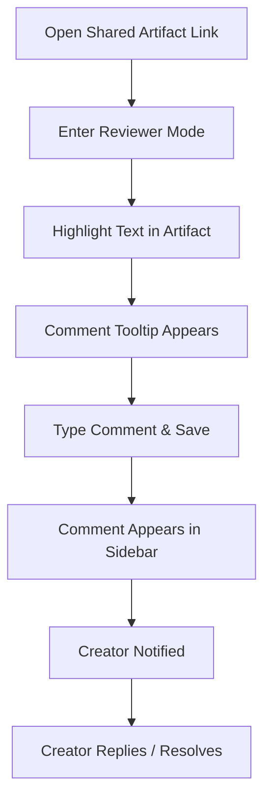

# 003 Reviewer Comments & Feedback Journey

**Persona:** Document Reviewer
**Goal:** Provide specific, contextual feedback on an artifact

## Overview
The core value of Artifact Review is contextual feedback. Reviewers can highlight text in the original artifact and leave comments that sync in real-time.

## Flow

## Screens

| Step | Screen | Notes |
|------|--------|-------|
| 1 | Document View | Reviewer sees the doc as if it was a live page |
| 2 | Selection | Highlighting text triggers the 'Comment' action |
| 3 | Comment Panel | Sidebar lists all threads with status and history |

## Notifications

Notifications are powered by [Novu](https://novu.co/) with both in-app and email channels.

### In-App (Bell Icon)
Real-time notifications appear in the notification center (bell icon in header).

| Event | Recipient | Message |
|-------|-----------|---------|
| **New Comment** | Artifact Owner | "[Author] commented on [Artifact]" |
| **Reply to Comment** | Comment Author | "[Author] replied to your comment" |
| **Reply in Thread** | Thread Participants | "[Author] replied in a thread you follow" |

### Email (Digest)
Emails are batched using Novu's digest feature. `NOVU_DIGEST_INTERVAL` controls the window (default: 10 min, set to 1 for testing).

| Event | Recipient | Subject |
|-------|-----------|---------|
| **New Comment(s)** | Artifact Owner | "X new comments on [Artifact]" |
| **Reply/Replies** | Comment/Thread Participants | "X new replies on [Artifact]" |

### E2E Test Coverage
- `tests/e2e/notification.spec.ts` - Validates in-app notification bell badge appears after comment/reply

## Feature Alignment (E2E Test)
Matches `app/tests/e2e/artifact-workflow.spec.ts` (Steps 4 & 5).

## Status & Actual State
- **Text Selection:** Implemented via iframe event bridging.
- **Real-time Sync:** Powered by Convex.
- **Replies/Resolutions:** Fully supported in sidebar.
- **Markdown Comments:** Support for formatting within comments.
