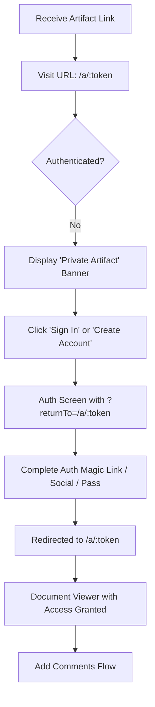

# 003.01 Invitee Onboarding & Deep Linking Journey

**Persona:** External Reviewer (Unauthenticated)
**Goal:** Access a private artifact for the first time via a shared link

## Overview
This journey covers the "Auth Bridge" experience for reviewers who receive a link to a private artifact but do not yet have an account or are not signed in. It ensures they are seamlessly redirected back to the artifact after authentication.

## Flow

## Screens

| Step | Screen | Notes |
|------|--------|-------|
| 1 | Unauthenticated Banner | "Private Artifact" message; High-contrast 'Sign In'/'Sign Up' options. |
| 2 | Auth Form | Standard login/register screen; `returnTo` state is preserved in URL. |
| 3 | Verification (Magic Link) | User stays in the flow; clicking the email link handles the deep-link. |
| 4 | Document Viewer | The intended artifact is rendered immediately upon successful auth. |

## Feature Alignment (E2E Test)
*Pending* - Needs a specific E2E test that starts at a private artifact URL while unauthenticated and verifies redirection post-login.

## Status & Actual State
- **Banner UI:** Implemented in `UnauthenticatedBanner.tsx`.
- **Redirection Logic:** Implemented using `returnTo` search parameters.
- **Deep Linking:** Fully supported across Magic Link and Social flows.
