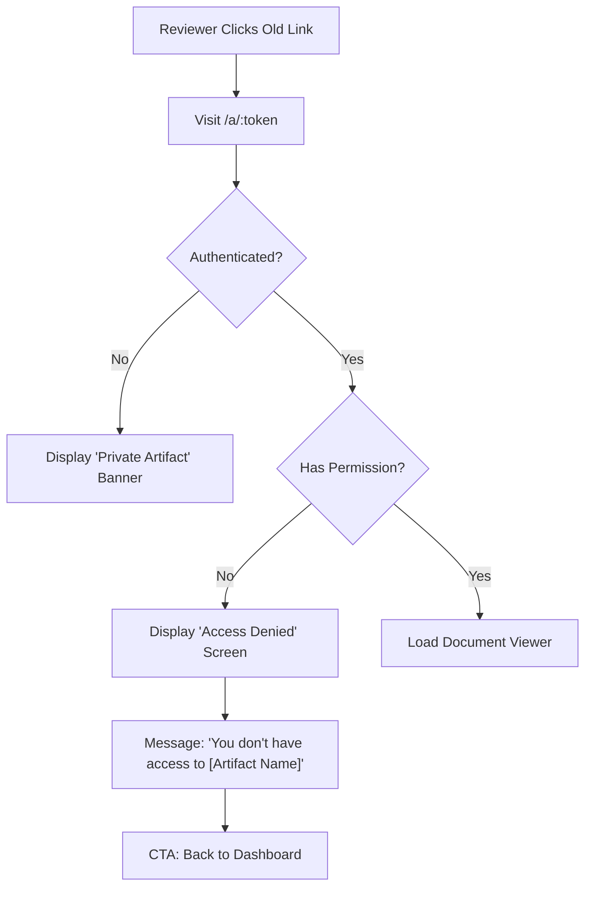

# 003.02 Revoked Access & Permissions Journey

**Persona:** Document Reviewer
**Goal:** Understand why access to an artifact is no longer available

## Overview
Access control is dynamic. A reviewer may lose access if the creator revokes their invitation or if they attempt to access an artifact using an account that wasn't invited. This journey covers the "Access Denied" experience.

## Flow

## Reviewer Experience
- **Immediate Feedback:** If a user is logged in but their `artifactAccess` record is marked `isDeleted: true`, the sidebar and document content are instantly replaced by the `AccessDeniedMessage`.
- **Security:** The system doesn't leak whether the artifact exists or just changed permissions; it provides a consistent "Access Denied" or "Not Found" state based on technical necessity.
- **Support:** The screen encourages the user to contact the owner for access, providing the context of which artifact they were trying to reach.

## Screens

| Step | Screen | Notes |
|------|--------|-------|
| 1 | Access Denied Screen | Lock icon; "You don't have access"; artifact name displayed for context. |
| 2 | Redirect | "Back to Dashboard" button helps find other shared work. |

## Feature Alignment (E2E Test)
*Pending* - Needs E2E test covering:
1.  **Real-time Revocation**: Reviewer is on page -> Creator revokes in another tab -> Reviewer sees Permission Error or Access Denied on refresh.
2.  **Cross-Account Attempt**: User A invited -> User B attempts to access while logged in -> User B sees Access Denied.

## Status & Actual State
- **UI:** Implemented in `AccessDeniedMessage.tsx`.
- **Enforcement:** Managed in `ArtifactViewerPage.tsx` via `userPermission` query.
