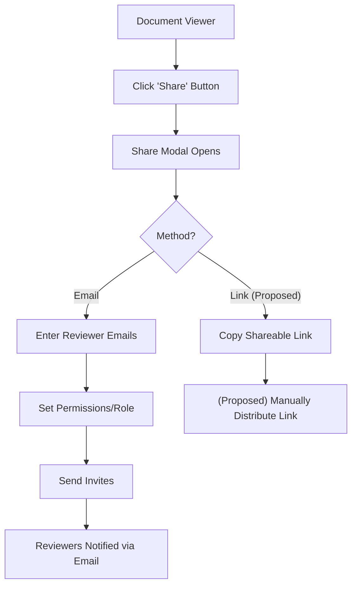

# 004 Artifact Sharing & Invites Journey (Hybrid: Actual + Proposed)

**Persona:** Document Creator
**Goal:** Securely share an artifact with reviewers and stakeholders

## Overview
Once an artifact is uploaded and verified, the creator needs to distribute it for feedback while controlling who has access.

## Flow

## Screens

| Step | Screen | Notes |
|------|--------|-------|
| 1 | Document Viewer | 'Share' button prominent in header |
| 2 | Share Modal | Tabs for 'Invite' and **(Proposed)** 'Link' |
| 3 | Email Notification | Clean email template with doc preview and CTA |

## Notifications

### In-App
- **Share sent:** Toast - "Invites sent to X reviewers"
- **Link copied:** Toast - "Link copied to clipboard"

### Email
- **Recipient:** Reviewers
- **Trigger:** Invite sent
- **Content:** "[Creator] shared '[Doc Name]' for review", doc preview, CTA link.

## Feature Alignment (E2E Test)
*Pending* - No specific E2E test covers the Share Modal interactions yet.

## Status & Actual State
- **Share Link:** (Proposed) Public/Team link sharing in design.
- **Email Invites:** Implemented via Resend.
- **Verification:** (Proposed) Email verification required before sharing ([See 010](./010-email-verification-on-sharing.md)).
- **Permissions:** Basic Viewer/Editor roles in progress.
