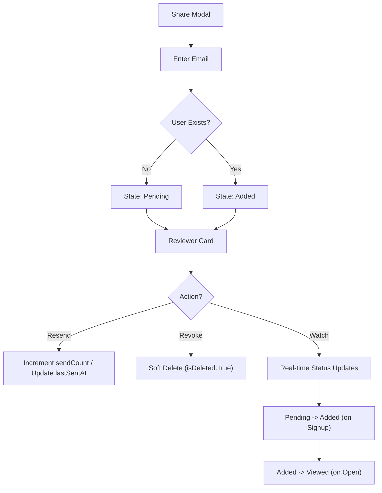

# 004.01 Reviewer Lifecycle & Invitation Management

**Persona:** Document Creator
**Goal:** Manage the full lifecycle of reviewer access, from initial invite to revocation

## Overview
Invitations transition through several states depending on whether the recipient is an existing user or a new user. This journey covers how authors track these states and take management actions like resending or revoking.

## Reviewer States

### New User (Pending Signup)
| State | Meaning | Dashboard Indicator |
|-------|---------|-------------------|
| **Pending** | Invitation email sent, but user has not signed up or viewed. | Yellow Badge: `Pending` |
| **Added** | User signed up via the invite link but has not opened the doc yet. | Green Badge: `Added` |
| **Viewed** | User has opened and viewed the artifact. | Blue Badge: `Viewed` |

### Existing User
| State | Meaning | Dashboard Indicator |
|-------|---------|-------------------|
| **Added** | User already had an account; access was granted immediately. | Green Badge: `Added` |
| **Viewed** | User has opened and viewed the artifact. | Blue Badge: `Viewed` |

## Flow: Management Actions

## Screens

| Step | Screen | Notes |
|------|--------|-------|
| 1 | Invite Section | Input email; system checks existence in background. |
| 2 | Reviewer List | Real-time list showing avatars, status badges, and action buttons. |
| 3 | Status Badge | Colors: Amber (Pending), Green (Added), Blue (Viewed). |
| 4 | Revoke/Remove | **Pending:** Show "Revoke" text button. **Active:** Show "X" icon button. |

## Flow: Revoke & Re-invite Logic

The system uses "Soft Deletion" to maintain history while allowing users to regain access seamlessly.

### 1. Revocation (Soft Delete)
- **Action:** Clicking "Revoke" or "X" triggers a confirmation dialog.
- **Backend:** Sets `isDeleted: true` and `deletedAt: now()` on the `artifactAccess` record.
- **User Effect:** The reviewer is immediately removed from the UI and loses access to the artifact (checked on next page load or query sync).

### 2. Re-invitation (Un-delete)
- **Action:** Author re-enters the same email in the Invite Section.
- **Backend Logic:**
    1. System finds the existing `isDeleted: true` record.
    2. It **un-deletes** the record (`isDeleted: false`).
    3. It updates `lastSentAt` to the current time.
    4. It increments the `sendCount` (e.g., if revoked then re-invited, total sends = 2).
    5. Triggers a fresh invite email via Resend.
- **User Effect:** The reviewer appears back in the list with their previous history (if they already viewed it, their status apppears correctly).

## Feature Alignment (E2E Test)
*Pending* - Needs E2E test covering:
1. **The Re-invite Loop:** Invite User -> Revoke Access -> Invite Same User -> Verify sendCount is 2 and status matches previous state.
2. **UI Parity:** Verify "Revoke" button exists for Pending and "X" exists for Viewed.
3. **Ghost State:** Verify revoked user can no longer access the artifact URL.
