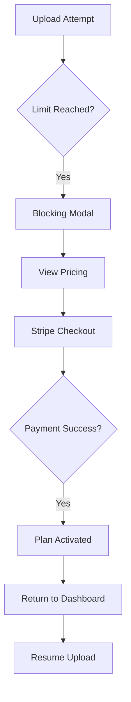

# 005 Plan Upgrade & Limits Journey (Actual)

**Persona:** Document Creator
**Goal:** Remove usage limits by upgrading to a Pro plan

## Overview
Free tier users have limits on the number of active documents and versions. This journey covers the transition to a paid plan via Stripe integration.

## Pricing Context

| Tier | Documents | Versions | Price |
|------|-----------|----------|-------|
| **Free** | 3 | Unlimited | $0 |
| **Pro** | Unlimited | Unlimited | $15/mo |

## Flow: Hitting a Limit

## Screens

| Step | Screen | Notes |
|------|--------|-------|
| 1 | Limit Modal | Appears when user tries to exceed 3 active docs |
| 2 | Pricing Page | Highlights Pro features; current plan status |
| 3 | Stripe Checkout | Secure external payment processing |
| 4 | Success Page | Reassurance that limits are lifted |

## Feature Alignment (E2E Test)
*Pending* - Needs E2E test for Stripe redirects and limit handling.

## Status & Actual State
- **Usage Tracking:** Implemented in Convex schema and enforced during upload.
- **Stripe Integration:** Fully functional in production and sandbox.
- **Limit Modals:** Implemented and active.
