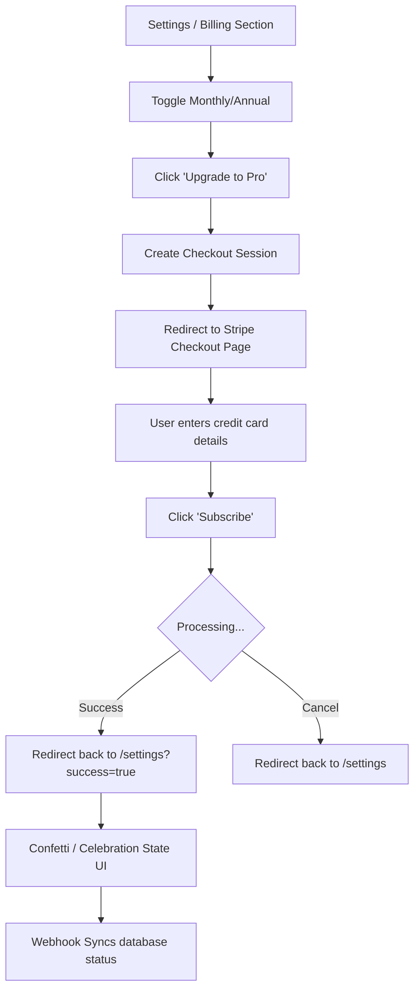

# 005.01 Stripe Checkout Flow

**Persona:** Document Creator (Free Tier)
**Goal:** Successfully upgrade to a Pro plan using Stripe Checkout

## Overview
This journey details the visual and functional flow when a user decides to upgrade their account. It features a celebratory success state upon completion and persistent feature access.

## Flow: Successful Upgrade

## Screens

| Step | Screen | Notes |
|------|--------|-------|
| 1 | Billing Card (Free) | Shows Annual first, highlights $24 savings. |
| 2 | Stripe Hosted Page | Secure credit card entry. |
| 3 | Settings (Success) | High-impact "You're all set!" celebration with checkmark. |
| 4 | Settings (Daily Use) | Subdued Pro view with billing intervals and next invoice date. |

## Feature Alignment
*   **Stripe Price IDs**: Configured in `plans.ts`.
*   **Checkout Action**: Correctly maps organizations to Stripe customers.
*   **Success Param**: Used to trigger temporary celebration UI.

## Status & Actual State
- **IMPLEMENTED**: Full end-to-end checkout with annual/monthly toggles is active.
- **Port Management**: Uses `getAppUrl` to ensure redirects always hit the local frontend.
