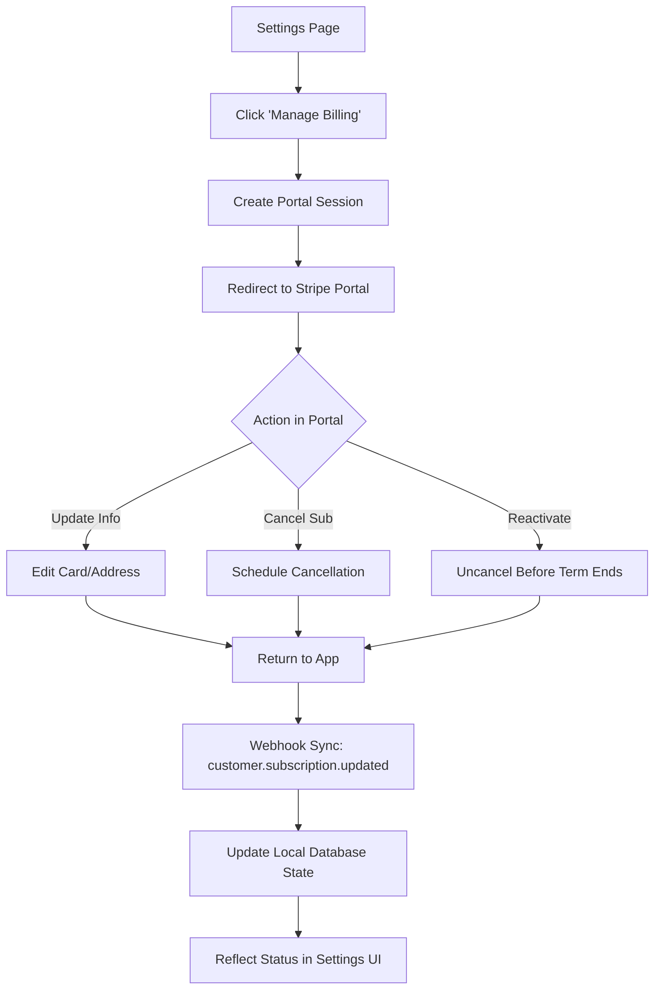

# 005.02 Customer Billing Portal & Lifecycle

**Persona:** Document Creator (Pro Tier)
**Goal:** Manage subscription, cancel, or reactivate via the Stripe portal

## Overview
Once a user is on a paid plan, they can manage their billing details, view invoice history, and control their subscription status using the self-service Billing Portal.

## Flow: Subscription Lifecycle Management

## Sub-Journey: Cancellation
1. **User Action**: Click "Cancel Plan" in the Stripe Portal.
2. **Stripe State**: Subscription marked for `cancel_at_period_end`.
3. **App State**: 
    - Webhook updates database.
    - Settings page shows an **Amber Notice** stating: *"Subscription Canceled. Your plan will end on [Date]."*
    - Features remain active until the period ends.

## Sub-Journey: Uncancel (Reactivation)
1. **User Action**: Change mind? Click "Don't cancel subscription" in the Stripe Portal.
2. **Stripe State**: Subscription returned to active (automatic renewal restored).
3. **App State**:
    - Webhook updates database.
    - Amber notice disappears.
    - Settings page returns to subdued "Active Subscription" state.

## Screens

| Step | Screen | Notes |
|------|--------|-------|
| 1 | Settings Page | Status badge shows "PRO". Manage button available. |
| 2 | Stripe Portal | Standard Stripe interface for cancellations/updates. |
| 3 | Settings (Canceled) | Shows "Pending Cancellation" banner with expiration date. |
| 4 | Settings (Reactivated)| Banner disappears; "Next billing date" restored. |

## Feature Alignment
*   **getBillingStatus Query**: Pulls `cancelAtPeriodEnd` and `currentPeriodEnd`.
*   **internalSyncSubscription Action**: Robust sync for cancellation flags.
*   **Stripe Webhooks**: `customer.subscription.updated` triggers local sync.

## Status & Actual State
- **IMPLEMENTED**: Full portal flow and status synchronization is functional in the development sandbox.
- **UI State**: Context-aware banners for cancellation and success states.
