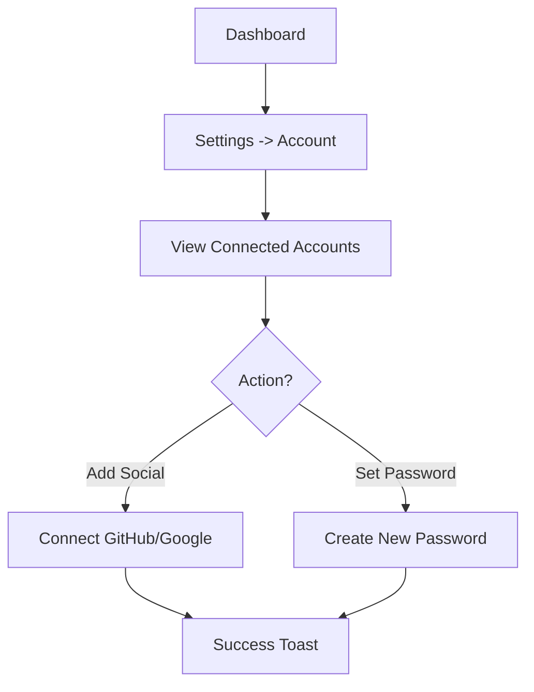

# 006 Account Settings & Security Journey

**Persona:** Document Creator
**Goal:** Manage account preferences and link additional authentication methods

## Overview
Users who sign up via Magic Link often want to add a permanent social login or password later for convenience and security.

## Flow

## Screens

| Step | Screen | Notes |
|------|--------|-------|
| 1 | Settings Page | Sidebar navigation for profile/security |
| 2 | Security Section | Shows 'Connected' badges or 'Connect' prompts |
| 3 | Password Dialog | Request current pass (if exists) or email verification |

## Status & Actual State
- **Settings UI:** Basic shell implemented.
- **Link Social:** Supported by Convex Auth backend.
- **Password Reset:** Implemented via Magic Link flow.
