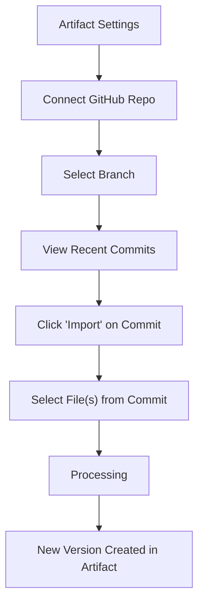

# 007 GitHub Manual Pull Journey (Proposed)

**Persona:** Document Creator
**Goal:** Import an artifact version directly from a GitHub commit

## Overview
This feature allows users to leverage Git as their source of truth without setting up complex CI/CD. Users connect a repo, browse commits, and "pull" a specific file revision as a new artifact version.

## Flow

## User Experience
- **Frictionless:** No need to download and re-upload ZIPs.
- **Traceable:** New versions link back to the GitHub commit hash.
- **Selective:** Only pull the specific documentation folder or HTML file needed.

## Status: PROPOSED
See `tasks/00034-github-manual-pull-feature.md` for technical requirements.
