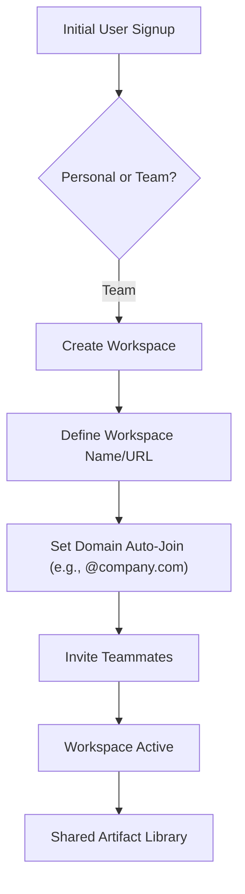

# 008 Team Workspace Onboarding (Proposed)

**Persona:** Team Lead / Admin
**Goal:** Set up a collaborative workspace for an entire organization

## Overview
Transitions the product from an individual tool to a team platform. Organizations can manage members, set domain-based auto-join rules, and share artifacts across the whole team.

## Flow

## Key Features
- **Domain Whitelisting:** Anyone with a specific email domain can automatically join.
- **Shared Projects:** Artifacts can be grouped by project and seen by all team members.
- **Admin Dashboard:** Manage billing and seats in one place.

## Status: PROPOSED
Aligns with the 'Team' tier strategy.
