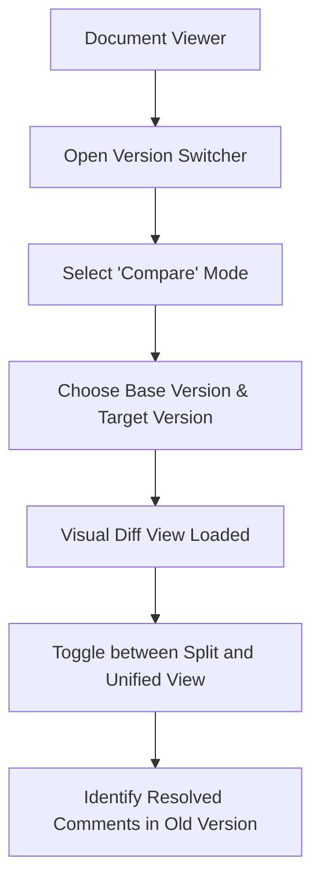

# 009 Version Comparison & Diff (Proposed)

**Persona:** Document Creator / Reviewer
**Goal:** Compare two versions of an artifact to identify changes

## Overview
As artifacts evolve through multiple rounds of feedback, stakeholders need to see what has changed between Version 1 and Version 2. This journey covers selecting versions and viewing a visual diff.

## Flow

## User Experience
- **Visual Highlighting:** Added text in green, removed in red.
- **Comment Overlay:** See comments from previous versions pinned to the context of the diff.
- **Navigation:** Easily jump between changes.

## Status: PROPOSED
Aligns with the 'Version History' roadmap feature.
