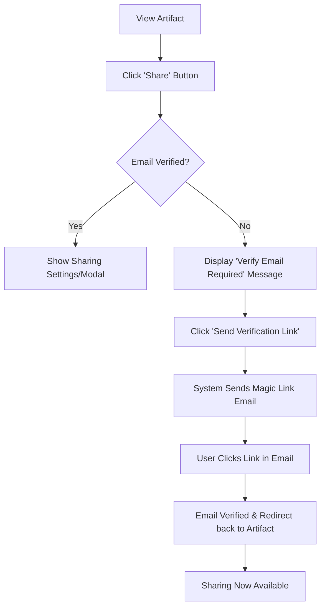

# Journey 010: Email Verification on Sharing (Proposed)

**Status:** Proposed  
**Persona:** Creator (Unverified)  
**Goal:** Prevent unverified users from sharing artifacts while providing a seamless verification path within the sharing workflow.

## Overview
Users who sign up via password authentication may not have verified their email addresses. For security and to prevent spam, sharing features are restricted until the email is verified. This journey documents the proactive verification flow triggered when a user attempts to share.

## Flow

## User Experience Details

### 1. Trigger
The user is viewing an artifact they created and clicks the **Share** button (or navigates to the **Access** tab in settings).

### 2. The Verification Gate
Instead of the standard sharing interface, the user sees a centered message:
- **Title:** Email Verification Required
- **Description:** To help prevent spam and keep our community safe, you must verify your email address before sharing artifacts with others.
- **CTA:** `Send Verification Link`

### 3. Verification Process
1.  User clicks the CTA.
2.  Button enters a loading state.
3.  Success toast: "Verification email sent to [email]".
4.  User checks their inbox and clicks the link.
5.  Link authenticates the user and marks `emailVerifiedAt` in the database.

### 4. Resolution
Post-verification, the user is redirected back to the artifact setttings page where the sharing interface is now fully active.

## Technical Considerations
- **Shared logic:** Reuse the Magic Link authentication bridge for verification.
- **State Management:** The `ArtifactAccessTab` should conditionally render based on `user.emailVerifiedAt`.
- **Email Template:** Create a specific "Verify your email" template (or reuse the general magic link template with specific copy).
- **Error Handling:** Expired verification links follow the [001.01 Expired Link Recovery](./001.01-expired-link-handling.md) pattern.
