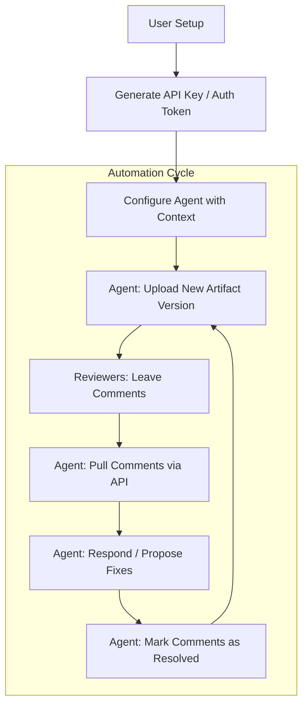

# 011 Agent-Powered Workflows (PROPOSED)

**Persona:** AI Agent (Claude Code, Gemini, etc.) controlled by a Document Creator
**Goal:** Automate artifact management, feedback loops, and comment resolution

## Overview
This journey documents how an AI agent interacts with the platform on behalf of a user. The agent uses API keys or session credentials to perform high-frequency tasks like uploading builds, context-aware comment resolution, and versioning.

## Flow: Agent Lifecycle

## Sub-Journey: Contextual Artifact Upload
1. **Trigger**: Developer runs a build command via agent (e.g., `claude upload-build`).
2. **Action**: Agent identifies changed files and creates a new artifact version.
3. **App State**: 
    - New version appears in the dashboard.
    - Previous comments are tagged to the old version but visible for context.

## Sub-Journey: Autonomous Comment Resolution
1. **Action**: Agent polls for new comments on a specific document.
2. **Logic**: Agent analyzes comment text vs. code/content.
3. **Response**: 
    - Agent posts a reply: *"I've updated the styles in version 4 to address this."*
    - Agent calls `resolveComment` endpoint.
4. **App State**: 
    - Comment is marked as resolved.
    - Contributor (the Agent) is credited for the resolution.

## Capabilities

| Feature | Agent Action | API Requirement |
|---------|--------------|-----------------|
| **Artifact Sync** | Create/Update Artifacts | `createArtifactMutation` |
| **Feedback Loop**| List Comments | `listCommentsQuery` |
| **Communication**| Post Reply | `addCommentMutation` |
| **Closure**      | Set Resolved State | `resolveCommentMutation` |

## Feature Alignment
*   **API Tokens**: Need a system for generating long-lived tokens for agents.
*   **Webhooks**: Outbound webhooks so agents don't have to poll for new comments.
*   **Agent Identity**: Mark comments/uploads with an "AI Agent" badge to distinguish from humans.

## Status & Actual State
- **PROPOSED**: Foundational mutations (upload/comment) exist but lack dedicated Agent API access/tokenization.
- **Next Step**: Define `AgentService` and standardized JSON-RPC or REST patterns for easy agent integration.
