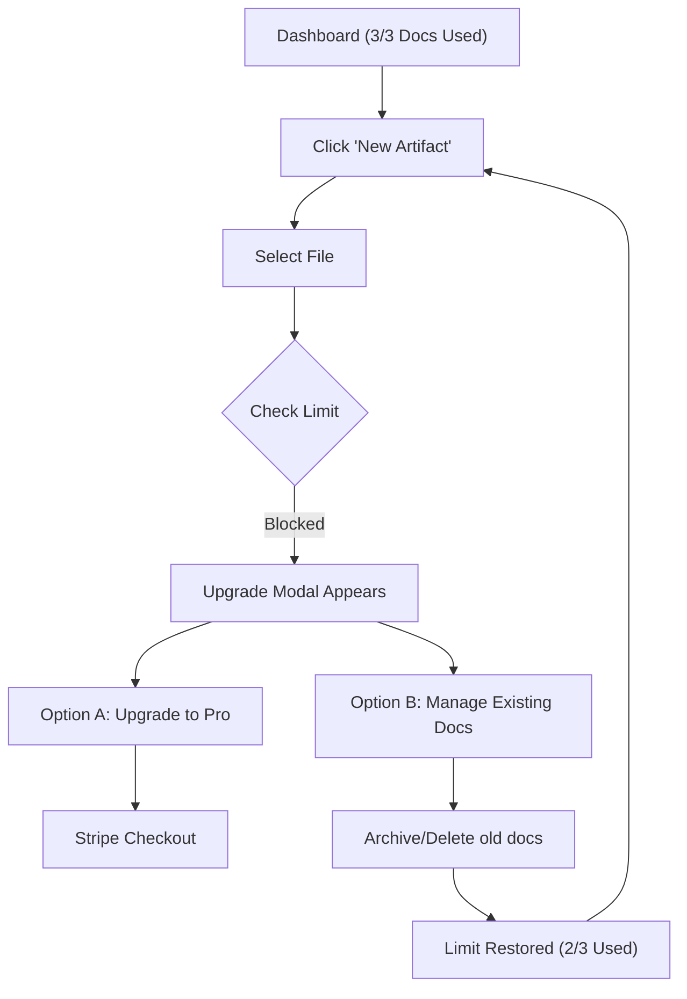

# 012 Free Tier Paywall Experience (Proposed)

**Persona:** Document Creator (Free Tier)
**Goal:** Understand usage limits and transition to Pro when needed

## Overview
To provide a friction-less "Trial" experience, the Free tier allows for full collaboration features (Unlimited versions, Unlimited reviewers, GitHub manual pull) but limits the total number of **Active Documents**.

## The Paywall Logic
- **Limit:** 3 Active Documents.
- **Trigger**: Attempting to upload a 4th document or import via GitHub.
- **Action**: Display a blocking "Upgrade to Pro" modal.

## Flow: Hitting the Limit

## User Experience Details

### 1. Proactive Visibility
The user should never be surprised.
- **Dashboard Widget**: A small "Usage" indicator in the sidebar or header (e.g., "3 / 3 Documents").
- **Visual Cues**: When at 3/3, the "New Artifact" button changes style or shows a tooltip.

### 2. The Blocking Modal
When the limit is hit, the modal should:
- **Validate Value**: "You've shared 3 artifacts and received [X] comments. Keep the momentum going!"
- **Clear CTA**: A primary "Upgrade to Pro for $12/mo" button.
- **Escape Hatch**: "Not ready? Delete an old artifact to make room."

### 3. Feature-Specific Paywalls (Soft)
While not blocking the "Upload" loop, some features are marked with a "Pro" badge:
- **Settings**: "Custom Branding" and "Advanced Comment Status" are visible but disabled with a "Upgrade" nudge.

## Feature Alignment
- **Convex Logic**: `artifacts:create` mutation checks `activeDocsCount` for the user's organization.
- **UI State**: `useUsage` hook provides the counts for the Progress bar and Modals.

## Status & Actual State
- **Usage Tracking**: Implemented in Convex.
- **Blocking Modal**: UI component drafted, integration with Stripe pending.
