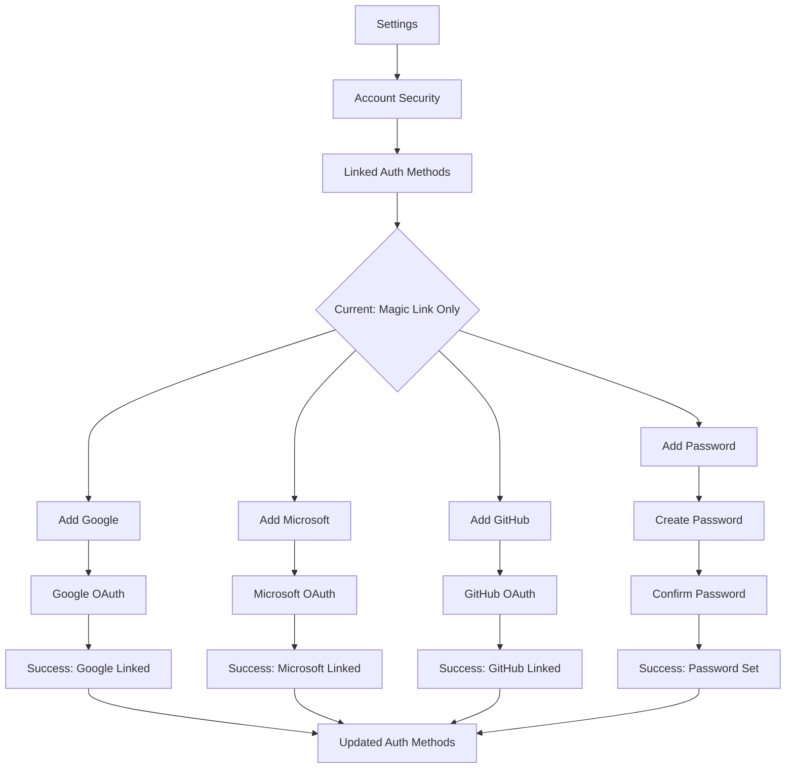

# Account Upgrade Journey

**Persona:** Document Creator
**Goal:** Add permanent auth method to magic-link-only account

## Context

Users who signed up via magic link may want to:
- Add social login for faster access
- Add email/password for credential control
- Link multiple auth methods

## Flow

## Screens

| Step | Screen | Notes |
|------|--------|-------|
| 1 | Settings | Account section in nav |
| 2 | Account Security | Shows current auth methods |
| 3 | Add Auth Method | Buttons for each option |
| 4 | OAuth Flow | Redirect to provider |
| 5 | Password Form | Create + confirm fields |
| 6 | Success | Confirmation, updated list |

## Auth Method States

| State | Display |
|-------|---------|
| Magic Link only | "Add a permanent sign-in method" prompt |
| Social linked | Provider icon with "Connected" badge |
| Password set | "Password" with "Change" option |
| Multiple methods | List all with ability to remove (keep min 1) |
