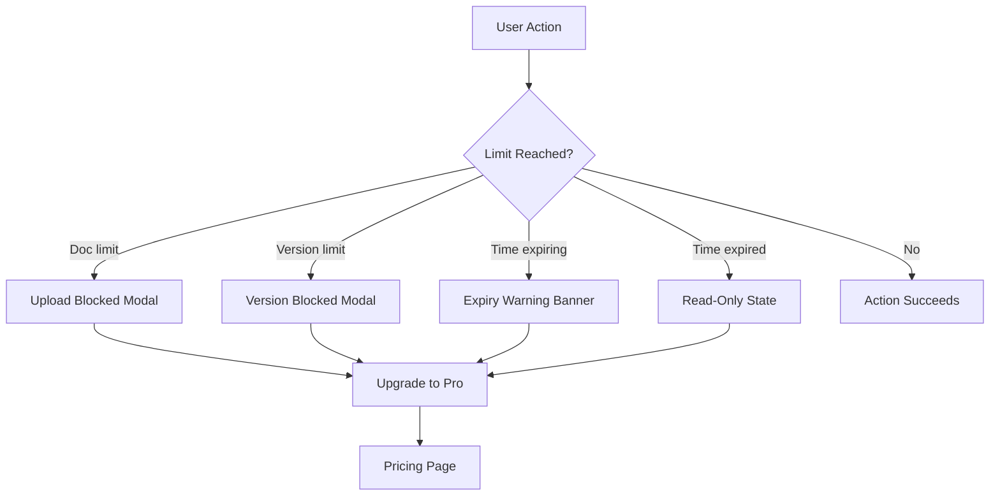
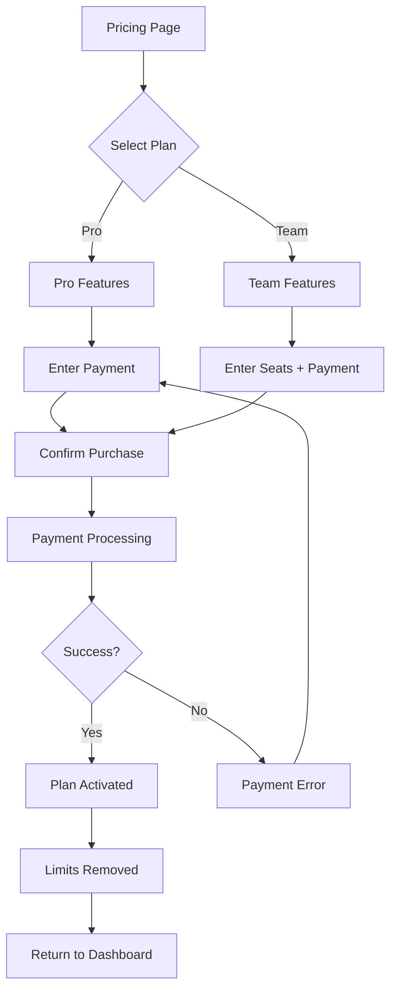
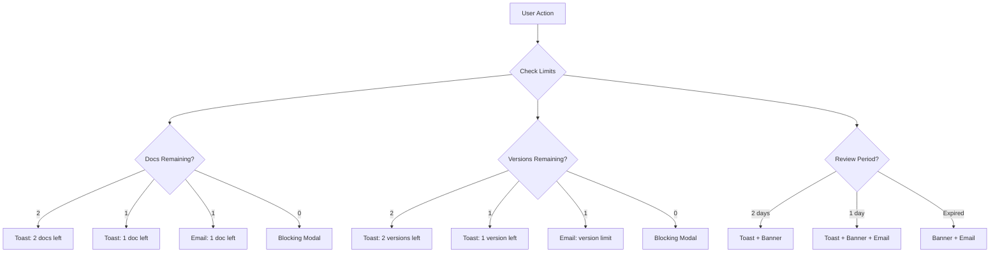

# Plan Upgrade Journey

**Persona:** Document Creator
**Goal:** Upgrade from Free to Paid to remove limits

## Pricing Tiers

| Tier | Documents | Versions | Review Period | Price |
|------|-----------|----------|---------------|-------|
| **Free** | 3 | 3 per doc | 5 days | $0 |
| **Pro** | Unlimited | Unlimited | Unlimited | $X/mo |
| **Team** | Unlimited | Unlimited | Unlimited | $X/user/mo |

**Note:** Reviewers always have free accounts. Only Document Creators need paid plans.

## Free Tier Limits

| Limit | Behavior |
|-------|----------|
| 3 documents | 4th upload blocked until upgrade |
| 3 versions per doc | 4th version blocked, must upgrade |
| 5-day review period | Comments locked, document read-only after expiry |

## Flow: Hitting a Limit

## Flow: Upgrade Process

## Screens

| Step | Screen | Notes |
|------|--------|-------|
| 1 | Limit Modal | Clear message, upgrade CTA |
| 2 | Pricing Page | Compare tiers, highlight current |
| 3 | Checkout | Stripe/payment form |
| 4 | Confirmation | Receipt, next steps |
| 5 | Dashboard | Limits removed, badge updated |

## Limit Notifications

### In-App Toasts

Toasts appear after successful actions when limits are approaching.

| Remaining | Document Toast | Version Toast |
|-----------|----------------|---------------|
| 2 left | "2 documents remaining. Upgrade for unlimited." | "2 versions remaining. Upgrade for unlimited." |
| 1 left | "1 document remaining. Upgrade for unlimited." | "1 version remaining. Upgrade for unlimited." |
| 0 left | Blocking modal (not toast) | Blocking modal (not toast) |

### Review Period Notifications

| Time | Channel | Message |
|------|---------|---------|
| 2 days left | Toast + Banner | "Review period ends in 2 days" |
| 1 day left | Toast + Banner + Email | "Review period ends tomorrow" |
| Expired | Banner + Email | "Review period ended. Comments locked." |

### Email Notifications

| Trigger | Email Subject | Content |
|---------|---------------|---------|
| 1 doc remaining | "You have 1 document left" | Usage summary, upgrade CTA |
| 1 version remaining | "Version limit approaching" | Doc name, upgrade CTA |
| 1 day before expiry | "Review ending tomorrow: [Doc Name]" | Doc link, upgrade CTA |
| Doc expired | "[Doc Name] is now read-only" | What happened, upgrade to reactivate |

### Notification Flow

## Upgrade Triggers

| Trigger | Location | UX |
|---------|----------|-----|
| Doc limit hit | Upload flow | Blocking modal |
| Version limit hit | Version upload | Blocking modal |
| 1 day before expiry | Dashboard, doc view | Warning banner |
| Expiry reached | Doc view | Read-only overlay, comments locked |
| Proactive | Settings, pricing link | Self-service |

## Post-Upgrade

- All limits removed immediately
- Expired docs become active again
- Comments unlocked on expired docs
- Version limits removed
- Review periods become unlimited
