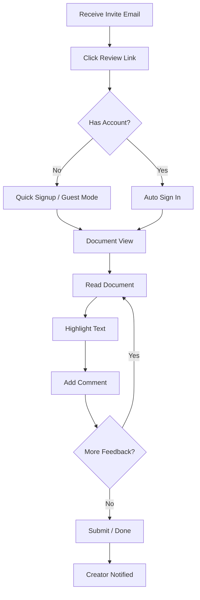

# Reviewer Comments Journey

**Persona:** Document Reviewer
**Goal:** Review a shared document and provide feedback

## Flow

## Screens

| Step | Screen | Notes |
|------|--------|-------|
| 1 | Email | Clear CTA, doc preview |
| 2 | Document View | Clean reading experience |
| 3 | Comment Panel | Appears on text selection |
| 4 | Thread View | Replies, @mentions |
| 5 | Success Toast | Feedback submitted |

## Notifications

### In-App

| Event | Type | Message |
|-------|------|---------|
| Comment posted | Toast | "Comment added" |
| @mention detected | Toast | "You mentioned [Name]" |
| Reply received | Toast | "[Name] replied to your comment" |

### Email

| Recipient | Trigger | Subject | Content |
|-----------|---------|---------|---------|
| Creator | New comment | "New comment on '[Doc Name]'" | Comment preview, doc link |
| @mentioned user | @mention in comment | "[Name] mentioned you in '[Doc Name]'" | Comment context, reply link |
| Comment author | Reply to comment | "[Name] replied to your comment" | Reply text, thread link |
| Creator | All comments resolved | "All feedback addressed on '[Doc Name]'" | Summary, view link |

### Email Batching

To prevent spam, comment emails are batched:
- If multiple comments within 1 hour → single digest email
- If @mentioned → immediate email (not batched)
- Max 3 comment emails per day per document
