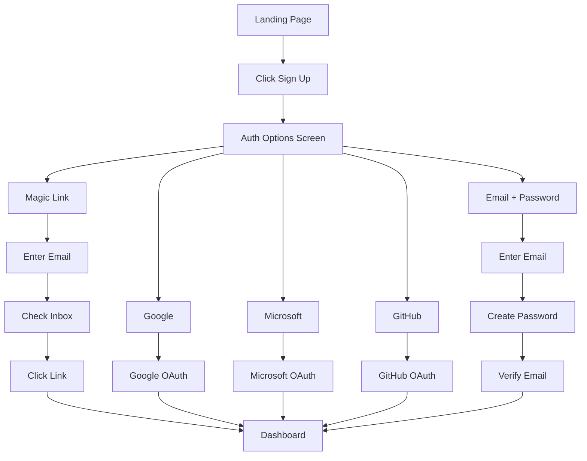

# Signup Journey

**Persona:** Document Creator
**Goal:** Create an account and get started

## Auth Options

| Priority | Method | Use Case |
|----------|--------|----------|
| 1 | Magic Link | Quick signup, lowest friction |
| 2 | Social (Google, Microsoft, GitHub) | Familiar, no password to remember |
| 3 | Email + Password | Traditional, full control |

## Flow

## Screens

| Step | Screen | Notes |
|------|--------|-------|
| 1 | Landing Page | Clear CTA for signup |
| 2 | Auth Options | Magic link prominent, social buttons, email/password link |
| 3a | Magic Link | Email input, "Check your inbox" confirmation |
| 3b | Social OAuth | Redirect to provider, return to app |
| 3c | Email/Password | Form with validation |
| 4 | Dashboard | Empty state with upload CTA |

## Sign In Flow

Returning users see same auth options. Magic link and social auto-match existing accounts by email.
