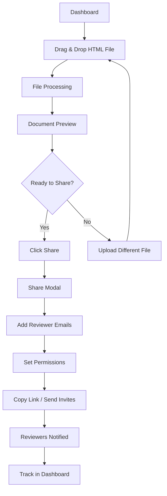

# Upload & Share Journey

**Persona:** Document Creator
**Goal:** Upload an HTML document and share it for review

## Flow

## Screens

| Step | Screen | Notes |
|------|--------|-------|
| 1 | Dashboard | Upload zone prominent |
| 2 | Upload Progress | Show file name, progress |
| 3 | Document Preview | Full render of HTML |
| 4 | Share Modal | Email input, permissions |
| 5 | Success State | Link copied, invites sent |
| 6 | Dashboard | Doc listed with status |

## Notifications

### In-App

| Event | Type | Message |
|-------|------|---------|
| Upload complete | Toast | "Document uploaded successfully" |
| Limit warning | Toast | "X documents remaining. Upgrade for unlimited." |
| Share sent | Toast | "Invites sent to X reviewers" |
| Link copied | Toast | "Link copied to clipboard" |

### Email

| Recipient | Trigger | Subject | Content |
|-----------|---------|---------|---------|
| Reviewers | Invite sent | "[Creator] shared '[Doc Name]' for review" | Doc preview, review CTA, link |
| Creator | All reviewers viewed | "Everyone has viewed '[Doc Name]'" | Status update, activity link |
| Creator | 2 days before expiry | "Review ending in 2 days: [Doc Name]" | Reminder, upgrade option |
| Creator | 1 day before expiry | "Review ending tomorrow: [Doc Name]" | Urgent reminder, upgrade CTA |
