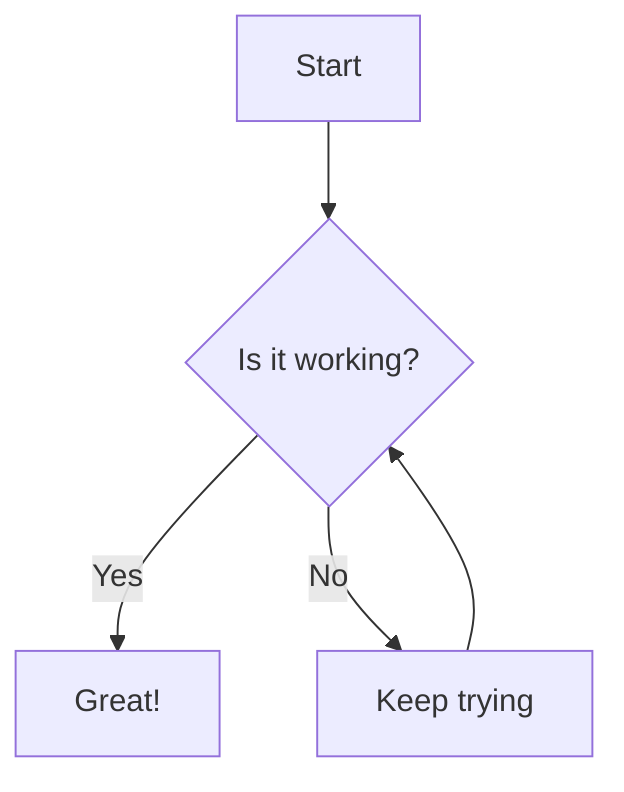
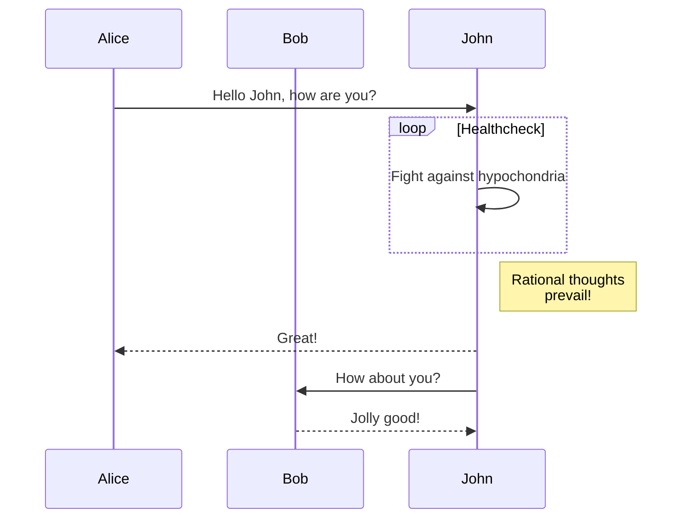
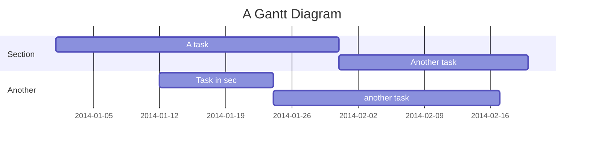

# Complex Markdown Demo with Mermaid

This document demonstrates complex markdown features, including GitHub-flavored markdown (GFM) and Mermaid diagrams.

## 1. Mermaid Diagrams

### Flowchart


### Sequence Diagram


### Gantt Chart


## 2. GFM Features

### Tables
| Name | Type | Description |
| :--- | :--- | :--- |
| `id` | `string` | Unique identifier |
| `value` | `number` | Numerical value |
| `active` | `boolean` | Status flag |

### Task Lists
- [x] Implement markdown rendering
- [x] Add code highlighting
- [ ] Implement Mermaid support
- [ ] Add emoji support

## 3. Code Blocks

```typescript
function helloWorld(): string {
  return "Hello, world!";
}
```

## 4. Typography

**Bold text**, *italic text*, and ~~strikethrough~~.

> This is a blockquote with **formatting**.

---

**File size:** ~1.2KB | **Type:** Markdown | **Status:** Valid ✅
