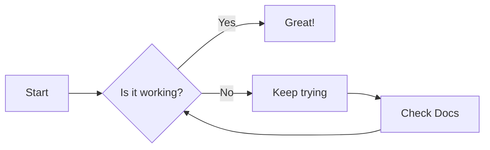
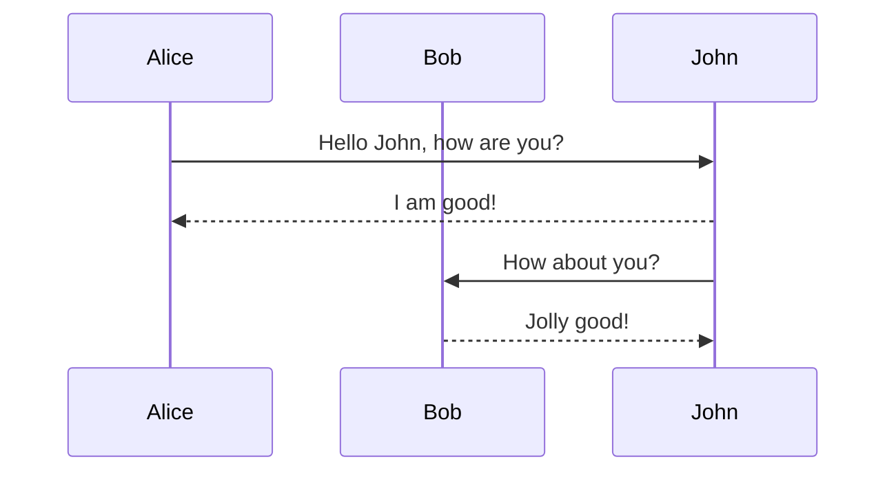
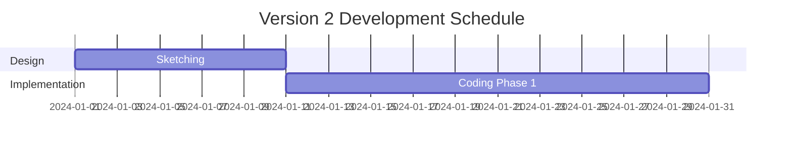

# Complex Markdown Demo - Version 2

This document demonstrates complex markdown features, including GitHub-flavored markdown (GFM) and Mermaid diagrams.

## 1. Mermaid Diagrams

### Updated Flowchart

### Sequence Diagram

### Gantt Chart

## 2. GFM Features

### Tables
| Property | Value | Description |
| :--- | :--- | :--- |
| `version` | `2.0` | Current version |
| `status` | `beta` | Development status |

### Task Lists
- [x] Implement markdown rendering
- [x] Add code highlighting
- [x] Basic Mermaid support
- [ ] Advanced Mermaid features

---

**File size:** ~1.3KB | **Type:** Markdown | **Status:** Valid ✅
