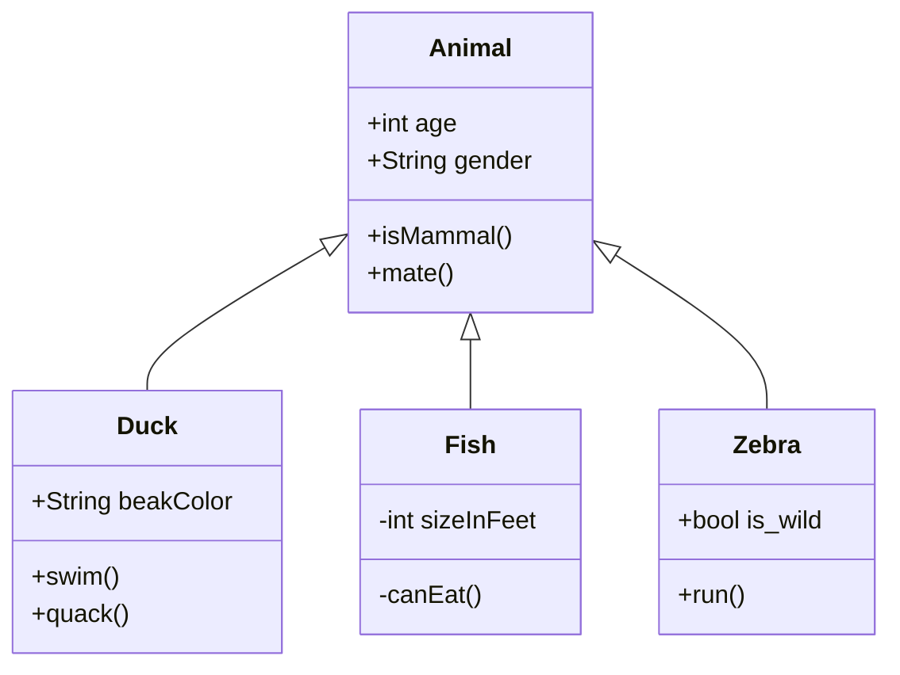
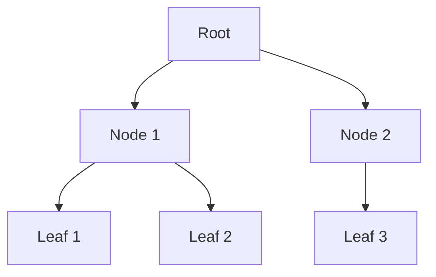

# Complex Markdown Demo - Version 3

This document demonstrates complex markdown features, including GitHub-flavored markdown (GFM) and Mermaid diagrams.

## 1. Mermaid Diagrams

### New: Class Diagram

### Flowchart

## 2. GFM Features

### Tables
| Feature | Supported | Notes |
| :--- | :---: | :--- |
| Mermaid | ✅ | Flow, Seq, Class |
| Math | ❌ | In backlog |

### Task Lists
- [x] Implement markdown rendering
- [x] Add code highlighting
- [x] Basic Mermaid support
- [x] Class Diagram support

---

**File size:** ~1.4KB | **Type:** Markdown | **Status:** Valid ✅
