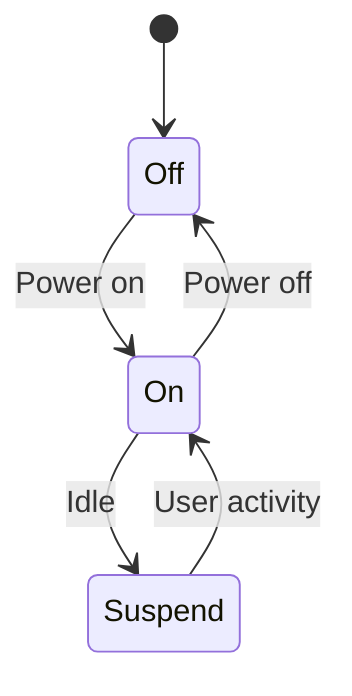
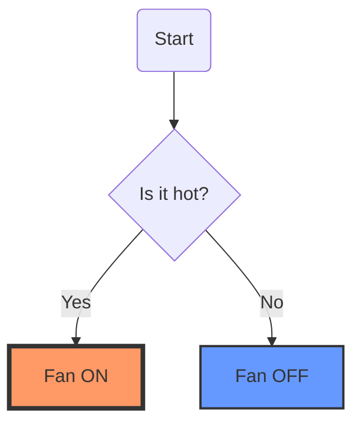

# Complex Markdown Demo - Version 4

This document demonstrates complex markdown features, including GitHub-flavored markdown (GFM) and Mermaid diagrams.

## 1. Mermaid Diagrams

### State Diagram

### Flowchart with Styling

## 2. GFM Features

### Formatting
This version adds **richer formatting** and ~~more tests~~.

> "Standardized testing is key to a robust platform."
> — AI Engineer

### Task Lists
- [x] Implement markdown rendering
- [x] Add code highlighting
- [x] Full Mermaid support
- [ ] Emoji support
- [ ] Footnotes

---

**File size:** ~1.2KB | **Type:** Markdown | **Status:** Valid ✅
