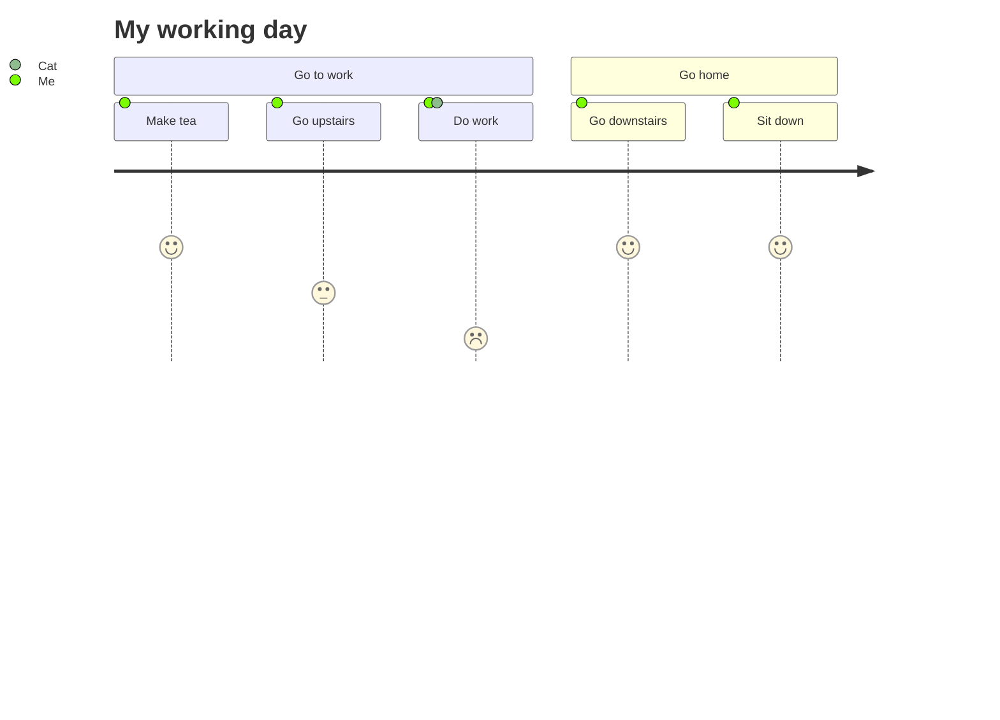
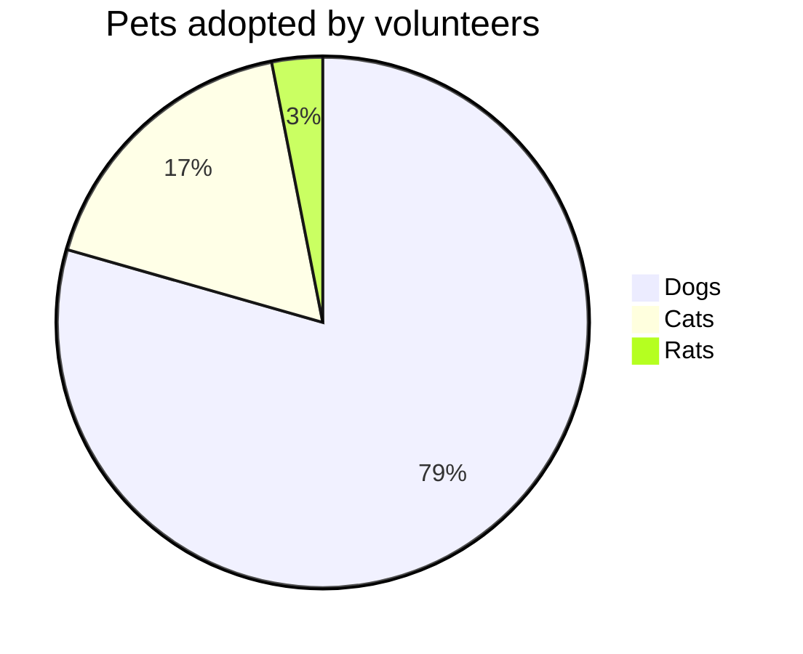
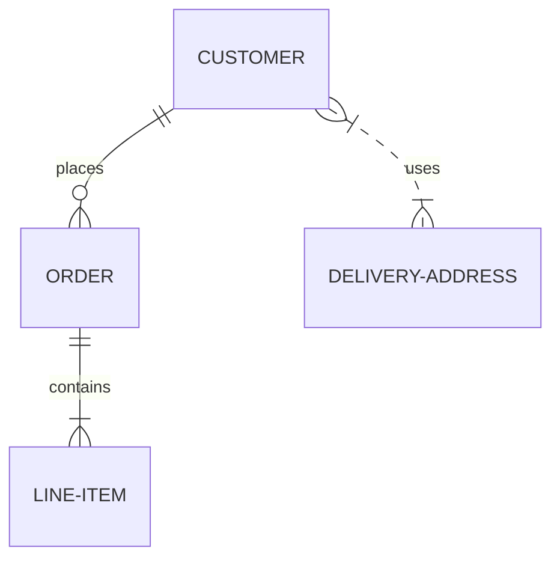

# Complex Markdown Demo - Version 5

The final version of the complex markdown demonstration featuring all primary Mermaid chart types.

## 1. Mermaid Diagrams

### User Journey


### Pie Chart


### Entity Relationship Diagram


## 2. Code Highlights

```python
def main():
    print("Version 5.0 is stable")
    artifacts = ["md", "html", "zip"]
    for a in artifacts:
        print(f"Tracking {a}...")

if __name__ == "__main__":
    main()
```

## 3. Final Summary

| Goal | Status |
| :--- | :--- |
| Rendering | Done |
| Performance | Optimized |
| Accessibility | Reviewed |

- [x] Phase 1: Complete
- [x] Phase 2: Complete
- [x] Validation: Success

---

**File size:** ~1.4KB | **Type:** Markdown | **Status:** Valid ✅
