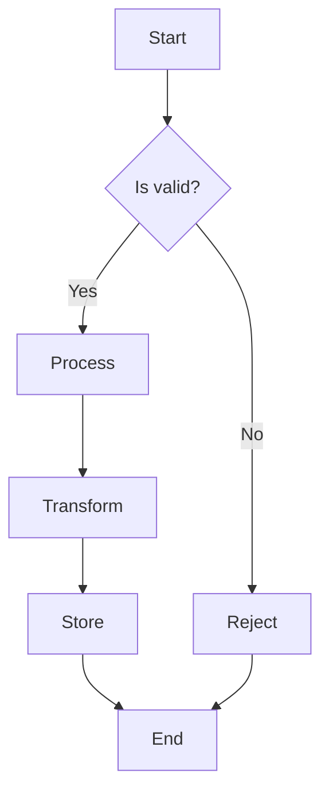
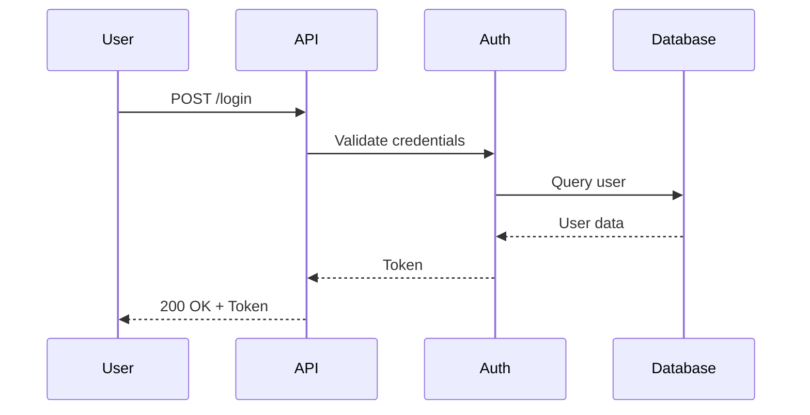

# Feature-Rich Markdown Sample

> This document contains all markdown features for comprehensive annotation testing.

## Table of Contents

- [Introduction](#introduction)
- [Text Formatting](#text-formatting)
- [Headings](#headings)
  - [Second Level](#second-level)
  - [Deep Nesting](#deep-nesting)
- [Lists](#lists)
  - [Unordered Lists](#unordered-lists)
  - [Ordered Lists](#ordered-lists)
  - [Task Lists](#task-lists)
- [Code Examples](#code-examples)
  - [JavaScript](#javascript)
  - [TypeScript](#typescript)
  - [Python](#python)
  - [SQL](#sql)
  - [Bash](#bash)
  - [JSON](#json)
  - [YAML](#yaml)
  - [Go](#go)
  - [Rust](#rust)
- [Tables](#tables)
- [Blockquotes](#blockquotes)
- [Diagrams](#diagrams)
- [Links and Images](#links-and-images)
- [Horizontal Rules](#horizontal-rules)
- [Long Paragraphs](#long-paragraphs)

---

## Introduction

This document serves as a comprehensive test fixture for the annotation system. Every element on this page should be selectable and annotatable. The content covers realistic documentation scenarios that users might encounter when reviewing AI-generated artifacts.

---

## Text Formatting

Here are various text formatting options:

- **Bold text** for emphasis
- *Italic text* for slight emphasis
- ***Bold and italic*** combined
- ~~Strikethrough text~~ for deletions
- `inline code` for technical terms
- Normal text for regular content

You can also combine them: **this is bold with `inline code` inside** and *this is italic with ~~strikethrough~~ inside*.

---

## Headings

# Heading Level 1

This is content under heading level 1.

## Second Level

This is content under heading level 2. It provides more detail than level 1.

### Third Level

Drilling down into specifics with level 3 headings.

#### Fourth Level

Even more detailed subsections at level 4.

##### Fifth Level

Rarely used but supported level 5.

###### Sixth Level

The deepest heading level available.

### Deep Nesting

Sometimes documentation has deeply nested sections. This tests the table of contents generation and anchor link navigation.

---

## Lists

### Unordered Lists

Simple list:
- First item
- Second item
- Third item

Nested list:
- Parent item 1
  - Child item 1.1
  - Child item 1.2
    - Grandchild item 1.2.1
    - Grandchild item 1.2.2
  - Child item 1.3
- Parent item 2
  - Child item 2.1

### Ordered Lists

1. First step
2. Second step
3. Third step

Nested ordered:
1. Major step 1
   1. Sub-step 1.1
   2. Sub-step 1.2
2. Major step 2
   1. Sub-step 2.1
   2. Sub-step 2.2
   3. Sub-step 2.3

Mixed nesting:
1. Install dependencies
   - npm packages
   - system libraries
2. Configure environment
   - Create `.env` file
   - Set required variables
3. Run the application
   1. Start the database
   2. Start the server
   3. Open the browser

### Task Lists

Project checklist:
- [x] Initialize repository
- [x] Set up CI/CD pipeline
- [x] Write initial documentation
- [ ] Implement core features
- [ ] Add comprehensive tests
- [ ] Deploy to production
- [ ] Monitor and iterate

---

## Code Examples

### JavaScript

```javascript
// Modern JavaScript with ES6+ features
import { createServer } from 'http';
import { readFile } from 'fs/promises';

const PORT = process.env.PORT || 3000;

async function handleRequest(req, res) {
  try {
    const data = await readFile('./data.json', 'utf-8');
    const parsed = JSON.parse(data);

    const filtered = parsed.items
      .filter(item => item.active)
      .map(item => ({
        id: item.id,
        name: item.name.toUpperCase(),
        timestamp: new Date().toISOString()
      }));

    res.writeHead(200, { 'Content-Type': 'application/json' });
    res.end(JSON.stringify(filtered, null, 2));
  } catch (error) {
    res.writeHead(500);
    res.end('Internal Server Error');
  }
}

const server = createServer(handleRequest);
server.listen(PORT, () => {
  console.log(`Server running on port ${PORT}`);
});
```

### TypeScript

```typescript
interface User {
  id: string;
  name: string;
  email: string;
  role: 'admin' | 'user' | 'guest';
  createdAt: Date;
  metadata?: Record<string, unknown>;
}

type UserCreateInput = Omit<User, 'id' | 'createdAt'>;
type UserUpdateInput = Partial<UserCreateInput>;

class UserService {
  private users: Map<string, User> = new Map();

  async create(input: UserCreateInput): Promise<User> {
    const user: User = {
      ...input,
      id: crypto.randomUUID(),
      createdAt: new Date()
    };

    this.users.set(user.id, user);
    return user;
  }

  async findById(id: string): Promise<User | undefined> {
    return this.users.get(id);
  }

  async update(id: string, input: UserUpdateInput): Promise<User> {
    const existing = this.users.get(id);
    if (!existing) {
      throw new Error(`User ${id} not found`);
    }

    const updated = { ...existing, ...input };
    this.users.set(id, updated);
    return updated;
  }
}

export { UserService, User, UserCreateInput, UserUpdateInput };
```

### Python

```python
from dataclasses import dataclass
from datetime import datetime
from typing import Optional, List, Dict, Any
import asyncio
import aiohttp

@dataclass
class Event:
    id: str
    type: str
    payload: Dict[str, Any]
    timestamp: datetime
    metadata: Optional[Dict[str, str]] = None

class EventProcessor:
    def __init__(self, batch_size: int = 100):
        self.batch_size = batch_size
        self.queue: List[Event] = []
        self._processing = False

    async def add_event(self, event: Event) -> None:
        self.queue.append(event)
        if len(self.queue) >= self.batch_size:
            await self.flush()

    async def flush(self) -> None:
        if self._processing or not self.queue:
            return

        self._processing = True
        batch = self.queue[:self.batch_size]
        self.queue = self.queue[self.batch_size:]

        try:
            async with aiohttp.ClientSession() as session:
                await session.post(
                    'https://api.example.com/events',
                    json=[e.__dict__ for e in batch]
                )
        finally:
            self._processing = False

    async def process_stream(self, events: List[Event]) -> Dict[str, int]:
        results = {'processed': 0, 'failed': 0}

        for event in events:
            try:
                await self.add_event(event)
                results['processed'] += 1
            except Exception as e:
                results['failed'] += 1
                print(f"Failed to process event {event.id}: {e}")

        await self.flush()
        return results
```

### SQL

```sql
-- Complex analytics query with CTEs and window functions
WITH monthly_sales AS (
    SELECT
        DATE_TRUNC('month', order_date) AS month,
        customer_id,
        product_category,
        SUM(amount) AS total_amount,
        COUNT(*) AS order_count
    FROM orders
    WHERE order_date >= DATE_TRUNC('year', CURRENT_DATE)
      AND status = 'completed'
    GROUP BY 1, 2, 3
),
customer_segments AS (
    SELECT
        customer_id,
        CASE
            WHEN total_lifetime_value > 10000 THEN 'enterprise'
            WHEN total_lifetime_value > 1000 THEN 'professional'
            ELSE 'starter'
        END AS segment
    FROM customers
),
ranked_sales AS (
    SELECT
        ms.*,
        cs.segment,
        ROW_NUMBER() OVER (
            PARTITION BY ms.month, cs.segment
            ORDER BY ms.total_amount DESC
        ) AS rank_in_segment,
        SUM(ms.total_amount) OVER (
            PARTITION BY ms.customer_id
            ORDER BY ms.month
            ROWS BETWEEN UNBOUNDED PRECEDING AND CURRENT ROW
        ) AS cumulative_amount
    FROM monthly_sales ms
    JOIN customer_segments cs ON ms.customer_id = cs.customer_id
)
SELECT
    month,
    segment,
    COUNT(DISTINCT customer_id) AS unique_customers,
    SUM(total_amount) AS segment_revenue,
    AVG(total_amount) AS avg_customer_revenue,
    PERCENTILE_CONT(0.5) WITHIN GROUP (ORDER BY total_amount) AS median_revenue
FROM ranked_sales
WHERE rank_in_segment <= 100
GROUP BY month, segment
ORDER BY month DESC, segment_revenue DESC;
```

### Bash

```bash
#!/bin/bash

# Deployment script with error handling and logging
set -euo pipefail

SCRIPT_DIR="$(cd "$(dirname "${BASH_SOURCE[0]}")" && pwd)"
LOG_FILE="${SCRIPT_DIR}/deploy.log"
ENVIRONMENT="${1:-staging}"

log() {
    local level="$1"
    shift
    echo "[$(date '+%Y-%m-%d %H:%M:%S')] [${level}] $*" | tee -a "${LOG_FILE}"
}

check_prerequisites() {
    log "INFO" "Checking prerequisites..."

    if ! command -v docker &> /dev/null; then
        log "ERROR" "Docker is not installed"
        exit 1
    fi

    if ! command -v kubectl &> /dev/null; then
        log "ERROR" "kubectl is not installed"
        exit 1
    fi

    log "INFO" "All prerequisites met"
}

build_image() {
    local tag="$1"
    log "INFO" "Building Docker image with tag: ${tag}"

    docker build \
        --build-arg BUILD_DATE="$(date -u +"%Y-%m-%dT%H:%M:%SZ")" \
        --build-arg VERSION="${tag}" \
        -t "myapp:${tag}" \
        -f "${SCRIPT_DIR}/Dockerfile" \
        "${SCRIPT_DIR}/.."

    log "INFO" "Image built successfully"
}

deploy() {
    local env="$1"
    local tag="$2"

    log "INFO" "Deploying to ${env} environment..."

    kubectl config use-context "${env}"
    kubectl set image deployment/myapp \
        myapp="myapp:${tag}" \
        --namespace="${env}"

    kubectl rollout status deployment/myapp \
        --namespace="${env}" \
        --timeout=300s

    log "INFO" "Deployment completed successfully"
}

main() {
    log "INFO" "Starting deployment to ${ENVIRONMENT}"

    check_prerequisites

    local git_sha
    git_sha=$(git rev-parse --short HEAD)
    local tag="${ENVIRONMENT}-${git_sha}"

    build_image "${tag}"
    deploy "${ENVIRONMENT}" "${tag}"

    log "INFO" "All done!"
}

main "$@"
```

### JSON

```json
{
  "name": "dataflow-pipeline",
  "version": "2.0.0",
  "description": "Real-time data processing pipeline",
  "config": {
    "source": {
      "type": "kafka",
      "brokers": ["broker1:9092", "broker2:9092"],
      "topic": "events",
      "consumerGroup": "pipeline-consumer"
    },
    "transforms": [
      {
        "type": "filter",
        "condition": "event.type == 'purchase'"
      },
      {
        "type": "enrich",
        "source": "postgres://analytics/users",
        "joinKey": "userId"
      },
      {
        "type": "aggregate",
        "window": "5m",
        "groupBy": ["region", "product"],
        "metrics": ["sum:amount", "count:*"]
      }
    ],
    "sink": {
      "type": "postgres",
      "connectionString": "${DATABASE_URL}",
      "table": "aggregated_sales",
      "batchSize": 1000
    }
  },
  "monitoring": {
    "metrics": {
      "enabled": true,
      "port": 9090
    },
    "logging": {
      "level": "info",
      "format": "json"
    }
  }
}
```

### YAML

```yaml
apiVersion: apps/v1
kind: Deployment
metadata:
  name: dataflow-pipeline
  namespace: data-platform
  labels:
    app: dataflow
    component: pipeline
    version: v2
spec:
  replicas: 3
  strategy:
    type: RollingUpdate
    rollingUpdate:
      maxSurge: 1
      maxUnavailable: 0
  selector:
    matchLabels:
      app: dataflow
      component: pipeline
  template:
    metadata:
      labels:
        app: dataflow
        component: pipeline
      annotations:
        prometheus.io/scrape: "true"
        prometheus.io/port: "9090"
    spec:
      containers:
        - name: pipeline
          image: dataflow/pipeline:2.0.0
          ports:
            - containerPort: 8080
              name: http
            - containerPort: 9090
              name: metrics
          env:
            - name: KAFKA_BROKERS
              valueFrom:
                configMapKeyRef:
                  name: dataflow-config
                  key: kafka.brokers
            - name: DATABASE_URL
              valueFrom:
                secretKeyRef:
                  name: dataflow-secrets
                  key: database-url
          resources:
            requests:
              memory: "512Mi"
              cpu: "250m"
            limits:
              memory: "2Gi"
              cpu: "1000m"
          livenessProbe:
            httpGet:
              path: /health/live
              port: 8080
            initialDelaySeconds: 30
            periodSeconds: 10
          readinessProbe:
            httpGet:
              path: /health/ready
              port: 8080
            initialDelaySeconds: 5
            periodSeconds: 5
```

### Go

```go
package main

import (
	"context"
	"encoding/json"
	"fmt"
	"log"
	"net/http"
	"os"
	"os/signal"
	"syscall"
	"time"
)

type Event struct {
	ID        string                 `json:"id"`
	Type      string                 `json:"type"`
	Payload   map[string]interface{} `json:"payload"`
	Timestamp time.Time              `json:"timestamp"`
}

type EventProcessor struct {
	queue   chan Event
	done    chan struct{}
	handler func(Event) error
}

func NewEventProcessor(bufferSize int, handler func(Event) error) *EventProcessor {
	return &EventProcessor{
		queue:   make(chan Event, bufferSize),
		done:    make(chan struct{}),
		handler: handler,
	}
}

func (p *EventProcessor) Start(ctx context.Context, workers int) {
	for i := 0; i < workers; i++ {
		go p.worker(ctx, i)
	}
}

func (p *EventProcessor) worker(ctx context.Context, id int) {
	log.Printf("Worker %d started", id)
	for {
		select {
		case event := <-p.queue:
			if err := p.handler(event); err != nil {
				log.Printf("Worker %d: error processing event %s: %v", id, event.ID, err)
			}
		case <-ctx.Done():
			log.Printf("Worker %d shutting down", id)
			return
		}
	}
}

func (p *EventProcessor) Submit(event Event) error {
	select {
	case p.queue <- event:
		return nil
	default:
		return fmt.Errorf("queue full, event %s dropped", event.ID)
	}
}

func main() {
	processor := NewEventProcessor(1000, func(e Event) error {
		log.Printf("Processing event: %s (type: %s)", e.ID, e.Type)
		return nil
	})

	ctx, cancel := context.WithCancel(context.Background())
	defer cancel()

	processor.Start(ctx, 4)

	http.HandleFunc("/events", func(w http.ResponseWriter, r *http.Request) {
		var event Event
		if err := json.NewDecoder(r.Body).Decode(&event); err != nil {
			http.Error(w, err.Error(), http.StatusBadRequest)
			return
		}
		event.Timestamp = time.Now()
		if err := processor.Submit(event); err != nil {
			http.Error(w, err.Error(), http.StatusServiceUnavailable)
			return
		}
		w.WriteHeader(http.StatusAccepted)
	})

	server := &http.Server{Addr: ":8080"}

	go func() {
		sigChan := make(chan os.Signal, 1)
		signal.Notify(sigChan, syscall.SIGINT, syscall.SIGTERM)
		<-sigChan
		log.Println("Shutting down...")
		cancel()
		server.Shutdown(context.Background())
	}()

	log.Println("Server starting on :8080")
	if err := server.ListenAndServe(); err != http.ErrServerClosed {
		log.Fatal(err)
	}
}
```

### Rust

```rust
use std::collections::HashMap;
use std::sync::Arc;
use tokio::sync::{mpsc, RwLock};
use serde::{Deserialize, Serialize};
use chrono::{DateTime, Utc};

#[derive(Debug, Clone, Serialize, Deserialize)]
pub struct Event {
    pub id: String,
    pub event_type: String,
    pub payload: HashMap<String, serde_json::Value>,
    pub timestamp: DateTime<Utc>,
}

#[derive(Debug)]
pub struct ProcessorConfig {
    pub buffer_size: usize,
    pub worker_count: usize,
    pub batch_size: usize,
}

impl Default for ProcessorConfig {
    fn default() -> Self {
        Self {
            buffer_size: 1000,
            worker_count: 4,
            batch_size: 100,
        }
    }
}

pub struct EventProcessor {
    sender: mpsc::Sender<Event>,
    metrics: Arc<RwLock<ProcessorMetrics>>,
}

#[derive(Debug, Default)]
struct ProcessorMetrics {
    events_processed: u64,
    events_failed: u64,
    processing_time_ms: f64,
}

impl EventProcessor {
    pub fn new(config: ProcessorConfig) -> Self {
        let (sender, mut receiver) = mpsc::channel::<Event>(config.buffer_size);
        let metrics = Arc::new(RwLock::new(ProcessorMetrics::default()));

        let metrics_clone = Arc::clone(&metrics);

        tokio::spawn(async move {
            while let Some(event) = receiver.recv().await {
                let start = std::time::Instant::now();

                match Self::process_event(&event).await {
                    Ok(_) => {
                        let mut m = metrics_clone.write().await;
                        m.events_processed += 1;
                        m.processing_time_ms += start.elapsed().as_secs_f64() * 1000.0;
                    }
                    Err(e) => {
                        eprintln!("Failed to process event {}: {}", event.id, e);
                        let mut m = metrics_clone.write().await;
                        m.events_failed += 1;
                    }
                }
            }
        });

        Self { sender, metrics }
    }

    async fn process_event(event: &Event) -> Result<(), Box<dyn std::error::Error + Send + Sync>> {
        // Simulate processing
        tokio::time::sleep(tokio::time::Duration::from_millis(10)).await;
        println!("Processed event: {} (type: {})", event.id, event.event_type);
        Ok(())
    }

    pub async fn submit(&self, event: Event) -> Result<(), mpsc::error::SendError<Event>> {
        self.sender.send(event).await
    }

    pub async fn get_metrics(&self) -> ProcessorMetrics {
        let m = self.metrics.read().await;
        ProcessorMetrics {
            events_processed: m.events_processed,
            events_failed: m.events_failed,
            processing_time_ms: m.processing_time_ms,
        }
    }
}

#[tokio::main]
async fn main() {
    let processor = EventProcessor::new(ProcessorConfig::default());

    // Submit some events
    for i in 0..10 {
        let event = Event {
            id: format!("event-{}", i),
            event_type: "test".to_string(),
            payload: HashMap::new(),
            timestamp: Utc::now(),
        };

        if let Err(e) = processor.submit(event).await {
            eprintln!("Failed to submit event: {}", e);
        }
    }

    // Wait a bit for processing
    tokio::time::sleep(tokio::time::Duration::from_secs(1)).await;

    let metrics = processor.get_metrics().await;
    println!("Metrics: {:?}", metrics);
}
```

---

## Tables

### Simple Table

| Name | Type | Description |
|------|------|-------------|
| id | string | Unique identifier |
| name | string | Display name |
| active | boolean | Whether enabled |

### Complex Table

| Feature | Free | Pro | Enterprise |
|---------|:----:|:---:|:----------:|
| Users | 5 | 50 | Unlimited |
| Storage | 1 GB | 100 GB | 1 TB |
| API Calls | 1K/day | 100K/day | Unlimited |
| Support | Community | Email | 24/7 Phone |
| SSO | - | - | Yes |
| Audit Logs | - | 30 days | 1 year |
| Custom Domain | - | Yes | Yes |
| SLA | - | 99.9% | 99.99% |

---

## Blockquotes

Simple quote:

> This is a simple blockquote. It contains a single paragraph of text that provides additional context or emphasis.

Nested quotes:

> This is the outer quote.
>
> > This is a nested quote inside the outer quote.
> > It can contain multiple lines.
>
> Back to the outer quote.

Quote with formatting:

> **Important:** This quote contains **bold text**, *italic text*, and `inline code`.
>
> It also has a list:
> - First point
> - Second point
> - Third point

---

## Diagrams

### Mermaid Flowchart



### Mermaid Sequence Diagram



---

## Links and Images

### External Links

- [GitHub](https://github.com) - Code hosting platform
- [MDN Web Docs](https://developer.mozilla.org) - Web development documentation
- [Stack Overflow](https://stackoverflow.com) - Q&A for developers

### Anchor Links

- Jump to [Introduction](#introduction)
- Jump to [Code Examples](#code-examples)
- Jump to [Python](#python)
- Jump to [Tables](#tables)

### Images

External image from CDN:


---

## Horizontal Rules

Content above the rule.

---

Another section after the rule.

***

And after another rule style.

___

Final content.

---

## Long Paragraphs

This paragraph contains a substantial amount of text to test text selection and annotation on longer content blocks. When users are reviewing documentation, they often need to highlight and comment on specific passages within larger paragraphs. The annotation system must correctly handle selections that span multiple lines and contain various formatting elements. This includes handling edge cases where the selection starts in the middle of a word or ends at a punctuation mark.

The second long paragraph continues the theme of providing substantial text content for testing purposes. In real-world usage, AI-generated documentation often contains detailed explanations that span multiple sentences. Reviewers need to be able to precisely select any portion of this text, from a single word to multiple sentences, and attach meaningful comments. The selection overlay must accurately highlight the selected region without interfering with the document's layout or the user's ability to read the surrounding context. Additionally, the system should handle cases where multiple annotations exist on overlapping or adjacent text regions.

A third paragraph ensures we have enough content to thoroughly test scrolling behavior and annotation persistence across viewport changes. When a document is longer than the visible viewport, annotations must remain correctly positioned as the user scrolls. This is particularly important for documents that will be reviewed by multiple stakeholders over time, where annotations from different reviewers may reference content throughout the entire document. The persistence layer must accurately store the text selection boundaries and restore them when the document is reloaded, even if the underlying content has minor formatting changes between versions.

---

*End of feature-rich markdown sample - Version 1.0*
