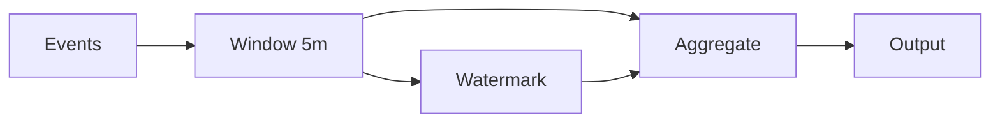

# DataFlow SDK Documentation v2

> A powerful toolkit for building data pipelines

## Table of Contents

- [Overview](#overview)
  - [Key Features](#key-features)
  - [What's New in v2](#whats-new-in-v2)
- [Quick Start](#quick-start)
- [Installation](#installation)
- [Core Concepts](#core-concepts)
  - [Pipelines](#pipelines)
  - [Transformations](#transformations)
  - [Windows and Watermarks](#windows-and-watermarks)
- [Related Documentation](#related-documentation)

---

## Overview

DataFlow SDK enables developers to build robust, scalable data pipelines with minimal boilerplate. Whether you're processing real-time streams or batch workloads, DataFlow provides the primitives you need.

### Key Features

| Feature | Description | Status |
|---------|-------------|--------|
| Stream Processing | Real-time data transformation | Stable |
| Batch Processing | Large-scale ETL jobs | Stable |
| Connectors | Pre-built integrations | **Stable** |
| Monitoring | Built-in observability | **Beta** |
| Schema Registry | Automatic schema evolution | **New** |

### What's New in v2

- Reorganized documentation structure for better navigation
- Added Schema Registry support
- Connectors promoted to stable
- New windowing and watermark APIs
- Improved TypeScript definitions

## Quick Start

Get up and running in under 5 minutes:

```bash
# Install the SDK
npm install @dataflow/sdk@2

# Initialize a new project
npx dataflow init my-pipeline --template stream

# Start the development server
cd my-pipeline && npm run dev
```

## Installation

### Prerequisites

Before installing, ensure you have:

- Node.js 18+ or Python 3.10+
- Docker (for local development)
- Access to a message broker (Kafka, RabbitMQ, or Redis)

### Package Managers

**npm:**
```bash
npm install @dataflow/sdk@2
```

**yarn:**
```bash
yarn add @dataflow/sdk@2
```

**pip:**
```bash
pip install dataflow-sdk>=2.0.0
```

## Core Concepts

### Pipelines

A pipeline is a directed acyclic graph (DAG) of processing stages:

```javascript
import { Pipeline, Stage } from '@dataflow/sdk';

const pipeline = new Pipeline('user-events', {
  schemaRegistry: 'http://localhost:8081'  // New in v2
});

pipeline
  .source('kafka://events')
  .transform(event => enrichUserData(event))
  .filter(event => event.type === 'purchase')
  .sink('postgres://analytics');

pipeline.run();
```

### Transformations

Transformations modify data as it flows through the pipeline:

```python
from dataflow import Pipeline, transforms

pipeline = Pipeline("sales-etl")

@pipeline.transform
def calculate_revenue(record):
    return {
        **record,
        "revenue": record["quantity"] * record["unit_price"]
    }

@pipeline.transform
def add_tax(record):
    tax_rate = get_tax_rate(record["region"])  # Dynamic tax rates
    return {
        **record,
        "tax": record["revenue"] * tax_rate,
        "total": record["revenue"] * (1 + tax_rate)
    }
```

### Windows and Watermarks

New in v2 - improved windowing support:

```javascript
import { Pipeline, windows } from '@dataflow/sdk';

pipeline
  .source('kafka://events')
  .window(windows.tumbling('5 minutes'))
  .aggregate({
    count: agg.count(),
    total: agg.sum('amount'),
    avg: agg.avg('amount')
  })
  .sink('postgres://metrics');
```



## Related Documentation

- [Getting Started Guide](./getting-started.md) - Detailed setup instructions
- [Configuration Reference](./guides/configuration.md) - All configuration options
- [API Overview](./api/overview.md) - Core API concepts
- [API Endpoints Reference](./api/endpoints.md) - Complete endpoint documentation

---

*DataFlow SDK v2.0 - Last updated: 2026-01-31*
