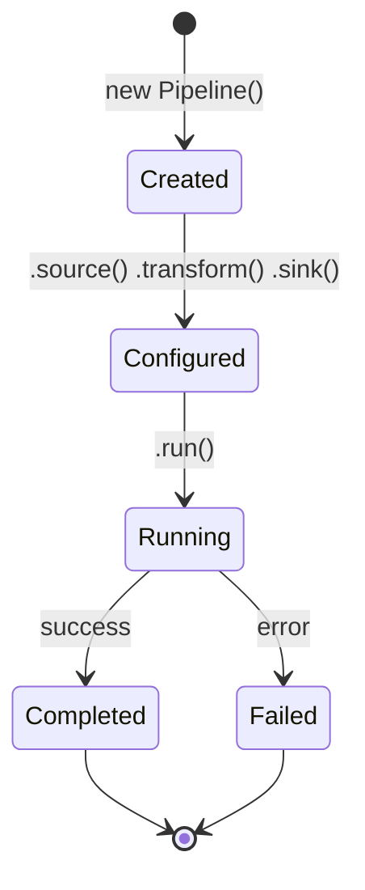
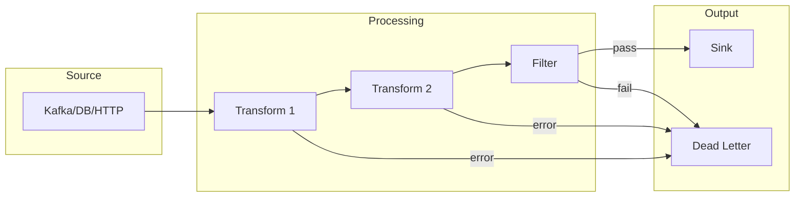

# API Overview

> **Note:** The API documentation has been split into Overview and Endpoints in v2 for better navigation.

## Table of Contents

- [Introduction](#introduction)
- [Core Classes](#core-classes)
  - [Pipeline](#pipeline)
  - [Stage](#stage)
  - [Context](#context)
- [Execution Model](#execution-model)
- [Error Handling Philosophy](#error-handling-philosophy)
- [TypeScript Support](#typescript-support)
- [See Also](#see-also)

---

## Introduction

The DataFlow SDK provides a fluent API for building data pipelines. This overview covers the core concepts; for detailed method signatures and examples, see the [Endpoints Reference](./endpoints.md).

### Design Principles

1. **Fluent API** - Method chaining for readable pipeline definitions
2. **Type Safety** - Full TypeScript support with generics
3. **Fail-Safe** - Dead-letter queues and retry mechanisms built-in
4. **Observable** - Metrics and tracing at every stage

## Core Classes

### Pipeline

The central class that orchestrates data flow:

```typescript
import { Pipeline } from '@dataflow/sdk';

const pipeline = new Pipeline<InputType, OutputType>(name, options);
```

**Key Characteristics:**

| Aspect | Description |
|--------|-------------|
| Immutable Config | Options set at construction |
| Lazy Execution | Nothing runs until `.run()` |
| Type Flow | Types propagate through stages |

**Lifecycle:**



### Stage

Represents a single processing step:

```typescript
interface Stage<In, Out> {
  name: string;
  type: 'source' | 'transform' | 'filter' | 'aggregate' | 'sink';
  process(input: In, context: Context): Out | Promise<Out>;
}
```

**Stage Types:**

| Type | Input | Output | Purpose |
|------|-------|--------|---------|
| `source` | External | Records | Ingest data |
| `transform` | Record | Record | Modify data |
| `filter` | Record | Boolean | Include/exclude |
| `aggregate` | Window | Aggregation | Combine records |
| `sink` | Record | External | Output data |

### Context

Runtime context available in all stages:

```typescript
interface Context {
  // Identification
  pipelineId: string;
  stageId: string;
  recordId: string;

  // Observability
  logger: Logger;
  metrics: Metrics;
  tracer: Tracer;

  // State (New in v2)
  state: StateStore;

  // Schema (New in v2)
  schema: SchemaRegistry;
}
```

**Example Usage:**

```javascript
pipeline.transform((record, ctx) => {
  ctx.logger.info('Processing record', { id: record.id });
  ctx.metrics.increment('records_processed');

  // Access shared state
  const enrichment = await ctx.state.get(`user:${record.userId}`);

  return { ...record, ...enrichment };
});
```

## Execution Model

### Data Flow



### Parallelism

```javascript
// Partition-level parallelism
const pipeline = new Pipeline('parallel', {
  parallelism: 8,  // Process 8 partitions concurrently
  ordering: 'partition'  // Maintain order within partition
});

// Record-level parallelism (New in v2)
const pipeline = new Pipeline('parallel', {
  parallelism: 8,
  ordering: 'none'  // Maximum throughput, no ordering
});
```

### Backpressure

DataFlow automatically handles backpressure:

```javascript
pipeline
  .source('kafka://high-volume', {
    maxInflight: 10000  // Buffer limit
  })
  .transform(slowOperation, {
    concurrency: 4,  // Limit concurrent operations
    timeout: 30000   // Per-record timeout
  })
  .sink('postgres://db', {
    batchSize: 1000,
    maxPending: 5    // Max batches pending write
  });
```

## Error Handling Philosophy

v2 introduces a tiered error handling model:

### Level 1: Record Errors

```javascript
pipeline.transform(risky, {
  onError: 'dead-letter'  // or 'skip', 'retry', 'fail'
});
```

### Level 2: Stage Errors

```javascript
pipeline.onStageError('transform', (error, records, ctx) => {
  ctx.logger.error('Stage failed', { error });
  return { action: 'retry', delay: 5000, maxAttempts: 3 };
});
```

### Level 3: Pipeline Errors

```javascript
pipeline.onPipelineError((error, ctx) => {
  alertOps(error);
  return { action: 'shutdown', exitCode: 1 };
});
```

## TypeScript Support

Full generic support for type-safe pipelines:

```typescript
import { Pipeline } from '@dataflow/sdk';

// Define your types
interface RawEvent {
  userId: string;
  action: string;
  timestamp: number;
}

interface EnrichedEvent extends RawEvent {
  userEmail: string;
  userSegment: 'free' | 'pro' | 'enterprise';
}

interface AggregatedMetric {
  segment: string;
  count: number;
  period: string;
}

// Type flows through the pipeline
const pipeline = new Pipeline<RawEvent, AggregatedMetric>('typed');

pipeline
  .source<RawEvent>('kafka://events')
  .transform<EnrichedEvent>(async (event, ctx) => {
    const user = await ctx.state.get(`user:${event.userId}`);
    return {
      ...event,
      userEmail: user.email,
      userSegment: user.plan
    };
  })
  .window(windows.tumbling('1 hour'))
  .aggregate<AggregatedMetric>({
    groupBy: 'userSegment',
    count: agg.count()
  })
  .sink<AggregatedMetric>('postgres://metrics');
```

## See Also

- [Endpoints Reference](./endpoints.md) - Detailed method documentation
- [Configuration Guide](../guides/configuration.md) - All configuration options
- [Getting Started](../getting-started.md) - Tutorial

---

*DataFlow SDK v2.0 API*
