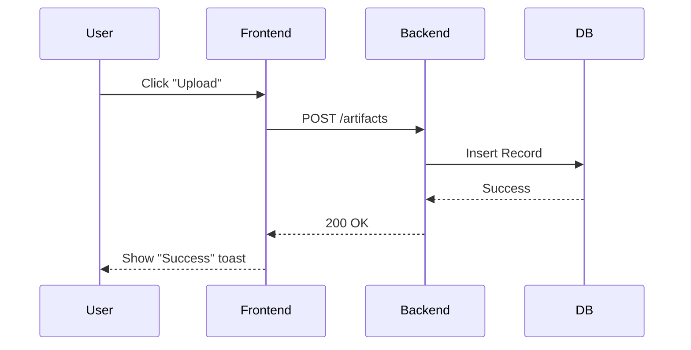
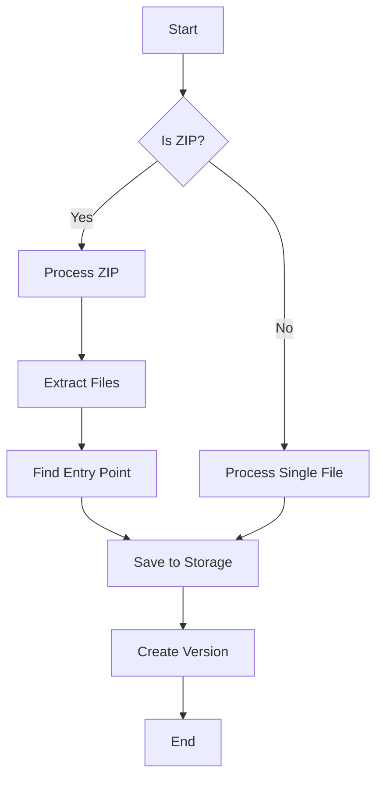
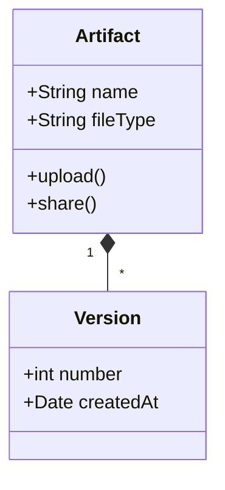

# System Architecture

Here are some diagrams illustrating the system.

## Sequence Diagram

```mermaid
sequenceDiagram
    participant User
    participant Frontend
    participant Backend
    participant DB

    User->>Frontend: Click "Upload"
    Frontend->>Backend: POST /artifacts
    Backend->>DB: Insert Record
    DB-->>Backend: Success
    Backend-->>Frontend: 200 OK
    Frontend-->>User: Show "Success" toast
```

## Flowchart

```mermaid
graph TD
    A[Start] --> B{Is ZIP?}
    B -- Yes --> C[Process ZIP]
    B -- No --> D[Process Single File]
    C --> E[Extract Files]
    E --> F[Find Entry Point]
    F --> G[Save to Storage]
    D --> G
    G --> H[Create Version]
    H --> I[End]
```

## Class Diagram

```mermaid
classDiagram
    class Artifact {
        +String name
        +String fileType
        +upload()
        +share()
    }
    class Version {
        +int number
        +Date createdAt
    }
    Artifact "1" *-- "*" Version
```
