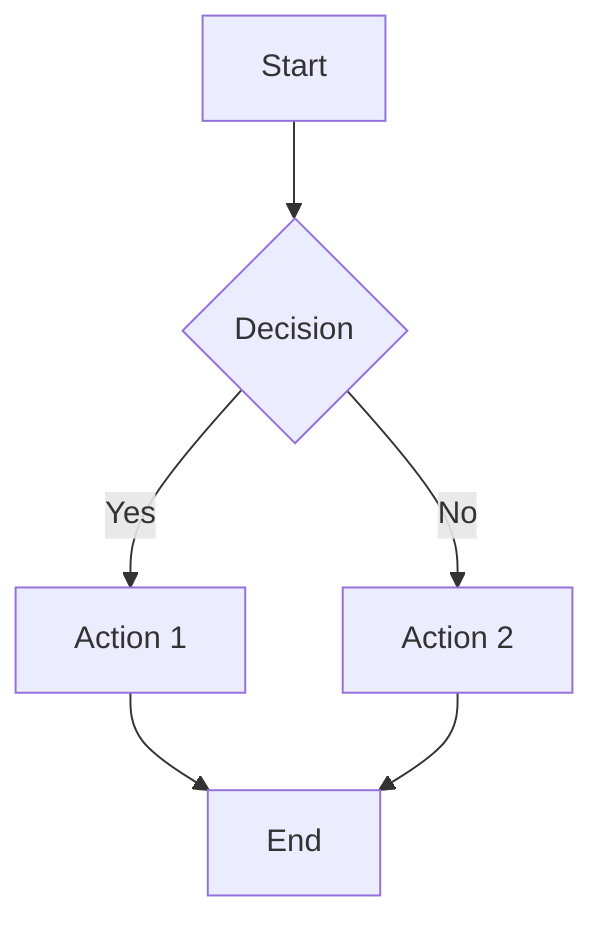
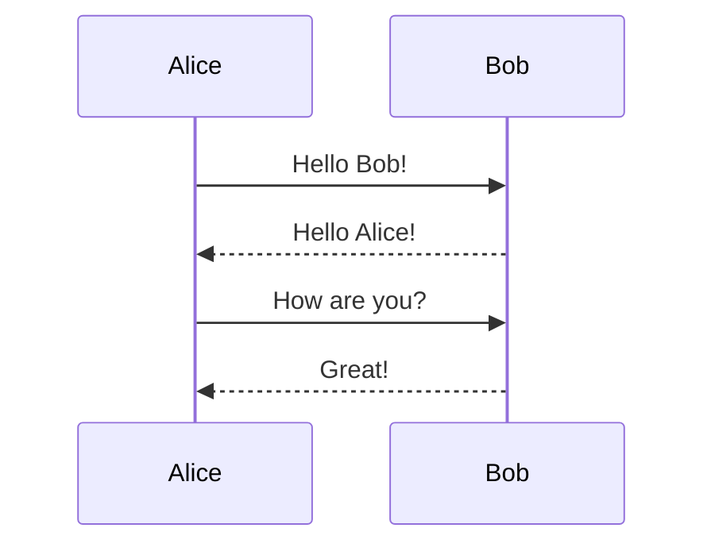
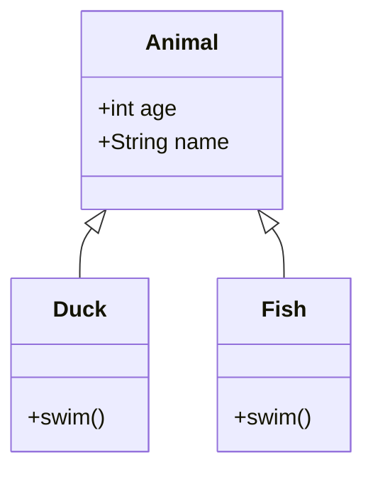

# Subtask 09: Phase 2 Testing and Validation

**Parent Task:** 00027-md-file-viewing-support
**Status:** PENDING
**Created:** 2026-01-03
**Phase:** 2

---

## Objective

Comprehensive testing of Phase 2 Mermaid diagram support to ensure diagrams render correctly and the lazy-loading strategy works as expected.

---

## Scope

Test all Phase 2 functionality:
1. Mermaid diagrams render correctly
2. Lazy loading works (bundle not loaded without diagrams)
3. Error handling for invalid syntax
4. Various diagram types

---

## Test Plan

### Unit Tests

Location: `tasks/00027-md-file-viewing-support/09_subtask_phase2-testing/tests/unit/`

1. **MermaidDiagram.test.tsx**
   - Renders valid flowchart
   - Renders valid sequence diagram
   - Shows error for invalid syntax
   - Shows loading state

2. **Mermaid Detection**
   - `containsMermaid()` returns true for mermaid blocks
   - Returns false for regular code blocks

### E2E Tests

Location: `tasks/00027-md-file-viewing-support/09_subtask_phase2-testing/tests/e2e/`

1. **mermaid-rendering.spec.ts**
   - Upload markdown with Mermaid diagrams
   - Diagram renders as SVG
   - Multiple diagram types work

2. **mermaid-lazy-loading.spec.ts**
   - Document without diagrams: Mermaid NOT loaded
   - Document with diagrams: Mermaid IS loaded
   - Check network requests

3. **mermaid-errors.spec.ts**
   - Invalid syntax shows fallback
   - Error message displayed
   - Code block still visible

### Manual Testing Checklist

- [ ] Flowchart diagram renders
- [ ] Sequence diagram renders
- [ ] Class diagram renders
- [ ] State diagram renders
- [ ] ER diagram renders
- [ ] Invalid syntax shows error gracefully
- [ ] Document without Mermaid doesn't load the library
- [ ] Page load time acceptable with large diagrams
- [ ] Diagrams render correctly on mobile

---

## Test Diagrams

### Flowchart



### Sequence Diagram



### Class Diagram



### Invalid Diagram (for error testing)

```mermaid
graph TD
    A --> B
    B --> [invalid syntax
```

---

## Bundle Size Verification

Verify lazy loading works:

1. Load markdown WITHOUT Mermaid - check Network tab
   - Mermaid chunk should NOT be loaded

2. Load markdown WITH Mermaid - check Network tab
   - Mermaid chunk should be loaded after initial page render

Record chunk sizes in test report.

---

## Deliverables

- [ ] Unit tests passing
- [ ] E2E tests passing with video recordings
- [ ] Bundle size verified (Mermaid lazy-loaded)
- [ ] Manual testing checklist complete
- [ ] Test report documenting coverage

---

## Test Report Template

Append to existing test-report.md:

```markdown
## Phase 2: Mermaid Support

**Date:** YYYY-MM-DD

### Diagram Types Tested

| Type | Renders | Errors Handled |
|------|---------|----------------|
| Flowchart | [x] | [x] |
| Sequence | [x] | [x] |
| Class | [x] | [x] |
| State | [x] | [x] |
| ER | [x] | [x] |

### Bundle Analysis

| Scenario | Mermaid Loaded | Chunk Size |
|----------|----------------|------------|
| No diagrams | No | N/A |
| With diagrams | Yes | ~2.7MB |

### Validation Videos

- `e2e-mermaid-flowchart.webm` - Flowchart rendering
- `e2e-mermaid-error.webm` - Error handling
```

---

## Dependencies

- Subtask 08 must be complete (Mermaid implemented)

---

## Notes

- Test with real Claude Code markdown output that contains Mermaid
- Verify no console errors during rendering
- Check accessibility of rendered SVG diagrams
