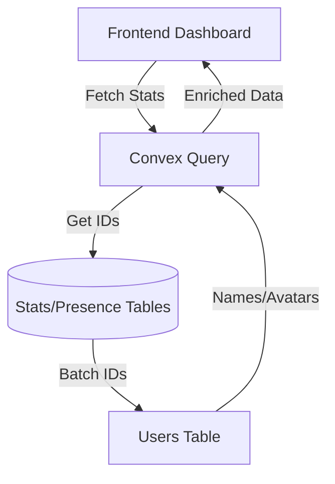

# Architecture Proposal: Artifact Views & Presence Tracking

Finalized architecture for tracking user engagement and real-time activity, ensuring performance, data integrity, and privacy.

---

## 1. The 3-Tier Tracking Model

We use a hierarchical approach to balance real-time responsiveness, reporting efficiency, and granular auditability.

| Tier | Table | Purpose | Answers the question... | Write Frequency |
| :--- | :--- | :--- | :--- | :--- |
| **1. Live** | `presence` | Heartbeats | "Who is looking at this *right now*?" | High (Every 15s) |
| **2. Aggregate** | `artifactVersionStats` | User/Version Matrix | "Has User X seen v2? How many times?" | Medium (Per Session) |
| **3. Ledger** | `artifactViews` | Granular History | "What is the full audit trail of views?" | Medium (Per Session) |

---

## 2. Schema Design (PII-Safe)

All tracking is strictly relational. **Names and emails are never stored in these tables.** They are resolved from the `users` table at read-time.

### Presence Table (`presence`)
```typescript
presence: defineTable({
  artifactId: v.id("artifacts"),
  versionId: v.id("artifactVersions"),
  userId: v.id("users"),
  lastSeen: v.number(),
})
.index("by_artifact_lastSeen", ["artifactId", "lastSeen"])
```

### Version Statistics (`artifactVersionStats`)
The "Aggregate" layer for fast reporting matrixes.
```typescript
artifactVersionStats: defineTable({
  artifactId: v.id("artifacts"),
  versionId: v.id("artifactVersions"),
  userId: v.id("users"),
  firstViewedAt: v.number(),
  lastViewedAt: v.number(),
  viewCount: v.number(),
})
.index("by_artifact_version", ["artifactId", "versionId"])
.index("by_user_artifact", ["userId", "artifactId"])
```

### View Ledger (`artifactViews`)
The "Source of Truth" for every distinct viewing session.
```typescript
artifactViews: defineTable({
  artifactId: v.id("artifacts"),
  versionId: v.id("artifactVersions"),
  userId: v.id("users"),
  viewedAt: v.number(),
})
.index("by_artifact_viewedAt", ["artifactId", "viewedAt"])
.index("by_version_user", ["versionId", "userId"])
```

---

## 3. Business Logic

### Recording a View (The "5-Minute Debounce")
To prevent ledger bloat from page refreshes, we use a session-based recording window:
1.  **Check existing stats**: Find `artifactVersionStats` for this (User, Version).
2.  **Determine if "New Session"**:
    - If no stats exist OR `lastViewedAt` > 5 minutes ago:
        - Insert into `artifactViews` (Ledger).
        - Increment `viewCount` in `artifactVersionStats`.
3.  **Always Update**: Set `lastViewedAt` in both `artifactVersionStats` and `artifactAccess` (cache).

### Requirement Mapping

| Requirement | Implementation |
| :--- | :--- |
| **Who's online now?** | Query `presence` where `lastSeen > now - 45s`. |
| **Who viewed *this version*?** | List all `userId`s from `artifactVersionStats` where `versionId == X`. |
| **How many times per person?** | Read `viewCount` from `artifactVersionStats`. |
| **Seen *any version* at all?** | Check `artifactAccess.firstViewedAt` or any row in `artifactVersionStats` for `userId`. |
| **First/Last Viewed timestamps?** | Read from `artifactVersionStats` for version-specific or `artifactAccess` for artifact-general. |

---

## 4. Identity Resolution flow



## 5. Decision History & References
- **PII Decision**: ADR 0014 (Strictly relational references).
- **Guest Logic**: Removed (Authenticated-only platform).
- **Ledger Choice**: Included for future-proofing analytics.
