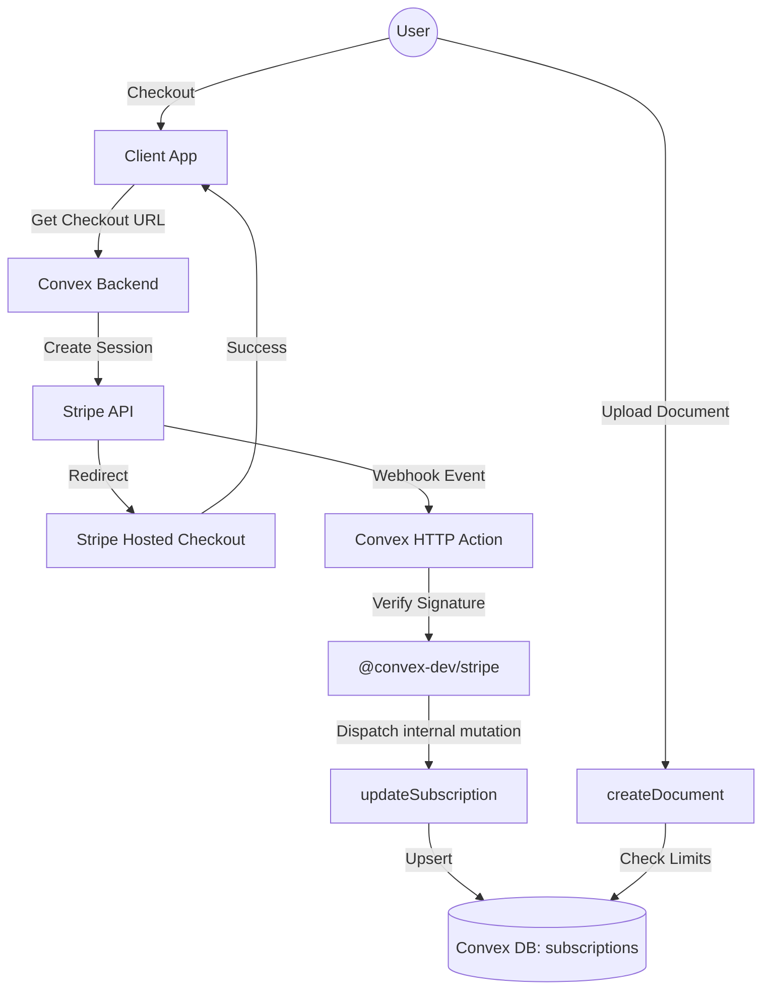

# Stripe Integration & License Management Architecture

## 📚 Appendix: Stripe Sandbox Setup Guide

Before writing code, you need to configure the Stripe "Test Mode" environment.

### 1. Stripe Dashboard (Test Mode)
1.  Log in to [Stripe Dashboard](https://dashboard.stripe.com/).
2.  **Toggle "Test Mode"** (Orange toggle in top right). **ALWAYS** ensure this is on.
3.  Go to **Products Catalog**:
    *   Create Product: "Artifact Review Pro".
    *   Add Price: $12 / Month.
    *   **COPY THE PRICE ID** (starts with `price_...`). You will need this for `convex/stripe/plans.ts`.

### 2. API Keys
1.  Go to **Developers > API keys**.
2.  Copy **Publishable Key** (`pk_test_...`).
3.  Copy **Secret Key** (`sk_test_...`).
4.  Save them for the `convex env set` step.

### 3. Webhook Configuration
We need Stripe to notify your Convex Dev Deployment.
1.  Get your Convex Dev URL: Run `npx convex run 'console.log(process.env.CONVEX_SITE_URL)'` or check `.env.local` (e.g., `https://crazy-cat-123.convex.cloud`).
2.  Go to **Stripe Dashboard > Developers > Webhooks**.
3.  **Add Endpoint**:
    *   **URL:** `https://<YOUR_CONVEX_DEV_URL>/stripe` (The default path for `@convex-dev/stripe`).
    *   **Events:**
        *   `checkout.session.completed`
        *   `customer.subscription.created`
        *   `customer.subscription.updated`
        *   `customer.subscription.deleted`
    *   **Add Endpoint**.
4.  **Copy Signing Secret** (`whsec_...`) from the top right of the webhook details page.

### 4. Set Convex Environment Variables
Run these commands in your terminal:
```bash
npx convex env set STRIPE_KEY "sk_test_..."
npx convex env set STRIPE_WEBHOOK_SECRET "whsec_..."
npx convex env set STRIPE_PRICE_ID_PRO "price_..."
npx convex env set NEXT_PUBLIC_STRIPE_PUBLISHABLE_KEY "pk_test_..."
```

---

## High-Level Architecture

We will use the **`@convex-dev/stripe`** library (standard Convex integration) to handle webhook signature verification and event mapping.

**Core Concept:** **Webhook-Driven Truth.**
We do *not* query Stripe on every request. Instead, we listen for Stripe Webhooks to maintain a local `subscriptions` table in Convex. This table is the "Source of Truth" for access control.



> [!NOTE] 
> **Alignment with Convex SaaS Template**
> This architecture is **logically congruent** with the SaaS Template but **structurally adapted** for B2B/Teams:
> 1.  **Billing Entity:** The Template binds `subscriptions` to `users`. We bind them to `organizations`. In our model, the "Organization" is the customer.
> 2.  **Plans Source:** The Template uses a `plans` table. We use `plans.ts` (Code) for MVP simplicity to avoid building a "Plan Sync" feature immediately.
> 3.  **Fields:** We use the exact same Stripe fields (`status`, `currentPeriodEnd`, `cancelAtPeriodEnd`) to ensure compatibility with standard webhooks.

### Gap Analysis: SaaS Template vs. Our Schema
| SaaS Template Field | Our Field | Logic / Why? |
| :--- | :--- | :--- |
| `userId` | `organizationId` | **Structural Change.** We subscribe Organizations, they subscribe Users. |
| *None* | `roles` | **Added.** The template is B2C (User=Admin). We have `members.roles` for Team permissions. |
| `planId` | `planId` | **Included.** We will sync Plans from Stripe to DB to support dynamic pricing pages. |
| `priceStripeId` | `stripePriceId` | **Renamed** to be consistent with our naming convention. |
| `stripeId` | `stripeSubscriptionId` | **Renamed** for clarity. |
| `currency` | `currency` | **Added.** Useful for showing "Paid in USD" in UI without API call. |
| `interval` | `interval` | **Added.** Useful for showing "Yearly" in UI. |
| `currentPeriodStart`| `currentPeriodStart` | **Added.** Useful for showing "Member since...". |

---

## 1. Schema & Data Model

We will abstract the "Billing Owner" into an `organizations` table.
For MVP, every user has exactly one "Personal Organization" created on signup. This makes the upgrade path to "Team" seamless (just invite people to your org).

### `schema.ts` Updates

```typescript
import { defineSchema, defineTable } from "convex/server";
import { v } from "convex/values";

export const ROLES = {
  OWNER: "owner",
  // Future roles (Phase 2):
  // ADMIN: "admin",
  // MEMBER: "member",
};

export default defineSchema({
  users: defineTable({
    name: v.string(),
    email: v.string(),
  }),

  organizations: defineTable({
    name: v.string(), // "Clint's Workspace"
    // Link to Stripe Customer (Org pays, not User)
    stripeCustomerId: v.optional(v.string()),
    createdAt: v.number(), // ADR 12
    createdBy: v.id("users"), // ADR 12
  }).index("by_stripeCustomerId", ["stripeCustomerId"]),

  plans: defineTable({
    key: v.string(),
    stripeId: v.string(),
    name: v.string(),
    description: v.string(),
    prices: v.any(), // JSON object with intervals (month/year)
    createdAt: v.number(), // ADR 12
  })
    .index("key", ["key"])
    .index("stripeId", ["stripeId"]),

  // Link Table: Who belongs to which Org?
  members: defineTable({
    userId: v.id("users"),
    organizationId: v.id("organizations"),
    roles: v.array(v.string()), // ["owner"] (MVP: Only owner supported initially)
    createdAt: v.number(), // ADR 12
    createdBy: v.id("users"), // Who added them?
  })
  .index("by_userId", ["userId"])
  .index("by_organizationId", ["organizationId"])
  .index("by_org_and_user", ["organizationId", "userId"]), // Compound for fast lookups

  subscriptions: defineTable({
    organizationId: v.id("organizations"), // Paid by Org
    planId: v.optional(v.id("plans")), // Linked Plan
    stripeSubscriptionId: v.string(),
    stripePriceId: v.string(), 
    status: v.string(),
    currentPeriodStart: v.number(), // Added for parity
    currentPeriodEnd: v.number(),
    cancelAtPeriodEnd: v.boolean(),
    currency: v.optional(v.string()), // Added for UI display
    interval: v.optional(v.string()), // "month" | "year"
    createdAt: v.number(), // ADR 12
  })
  .index("by_organizationId", ["organizationId"])
  .index("by_stripeSubscriptionId", ["stripeSubscriptionId"]),
});
```

---

## 2. Configuration: `plans.ts`

We will define our tiers in code to easily map Stripe Price IDs to internal "Plan Keys". This keeps our logic (`if (plan === 'PRO')`) decoupled from raw Stripe IDs.

```typescript
// convex/stripe/plans.ts

export const PLANS = {
  FREE: {
    key: "FREE",
    name: "Free Tier",
    limits: {
      documents: 3,
      versionsPerDoc: 5,
      publicLinks: true,
      agentApi: false, // Read-Only
      seats: 1, // Personal only
    },
    stripePriceId: null,
  },
  PRO: {
    key: "PRO",
    name: "Pro Plan",
    limits: {
      documents: Infinity,
      versionsPerDoc: Infinity,
      publicLinks: true,
      agentApi: true, // Read+Write
      seats: 1, // Still Personal only
    },
    // Map to the actual Stripe Price ID (use env vars for Dev/Prod split)
    stripePriceId: process.env.STRIPE_PRICE_ID_PRO, 
  },
};

export function getPlanConfig(priceId: string | null) {
  if (!priceId) return PLANS.FREE;
  const plan = Object.values(PLANS).find(p => p.stripePriceId === priceId);
  return plan || PLANS.FREE; // Fallback to free if unknown price
}
```

---

## 3. License Tracking (The "Sync" Logic)

We use the `@convex-dev/stripe` helper to register webhook handlers.

**Key Webhooks to Handle:**
1.  `customer.subscription.created`: Create record in `subscriptions`.
2.  `customer.subscription.updated`: Update subscription status.
3.  `customer.subscription.deleted`: Mark status as `canceled`.
4.  `checkout.session.completed`: Use `client_reference_id` (passed as `organizationId` during checkout) to link Stripe Customer to `organizations` table.

**The "Canceled" State:**
*   If a user cancels in Stripe, `cancel_at_period_end` becomes `true`.
*   We **DO NOT** revoke access immediately.
*   We allow access until `currentPeriodEnd` is reached.
*   Our `hasActiveLicense` helper must check:
    ```typescript
    const now = Date.now();
    const isActive = sub.status === 'active' || (sub.status === 'canceled' && sub.currentPeriodEnd > now);
    ```

---

## 4. Enforcement Strategy

We enforce limits at the **Mutation Layer** (Server-Side).

**Helper: `getUsage(ctx, userId)`**
*   Count documents: `ctx.db.query("documents").withIndex("by_owner", ...).collect().length`

**Helper: `enforceLimit(ctx, userId, feature)`**

```typescript
// In a mutation (e.g., createDocument)
export const createDocument = mutation({
  args: { ... },
  handler: async (ctx, args) => {
    const user = await ctx.auth.getUserIdentity();
    
    // 1. Get User's Membership (For MVP, assume active org or pass ID)
    const membership = await ctx.db.query("members")
        .withIndex("by_userId", q => q.eq("userId", user.subject))
        .first();
        
    if (!membership) throw new Error("No organization found");
    
    // 2. Get Subscription for that Org
    const subscription = await ctx.db.query("subscriptions")
      .withIndex("by_organizationId", q => q.eq("organizationId", membership.organizationId))
      .first();
      
    const plan = getPlanConfig(subscription?.stripePriceId);

    // 1. Check Document Limit
    if (plan.limits.documents !== Infinity) {
      // Check Usage for the ORGANIZATION
      const usage = await getUsage(ctx, membership.organizationId);
      if (usage >= plan.limits.documents) {
        throw new ConvexError({
          code: "LIMIT_EXCEEDED",
          message: "You have reached the Free tier limit of 3 documents. Please upgrade to Pro."
        });
      }
    }
    
    // Proceed...
  }
});

// In a mutation (e.g., addMember)
export const addMember = mutation({
  args: { ... },
  handler: async (ctx, args) => {
     // ... resolve plan ...
     
     // 2. Check Seat Limit
     if (plan.limits.seats !== Infinity) {
       const currentMembers = await ctx.db.query("members").withIndex("by_organizationId", ...).collect().length;
       if (currentMembers >= plan.limits.seats) {
         throw new ConvexError("Upgrade to Team Plan to add members.");
       }
     }
  }
});
```

## 7. Multi-Organization Strategy

Our Schema (`members` table) natively supports users belonging to multiple organizations.

**User Flows:**
1.  **Upgrade Personal:** User upgrades their default "Personal Org" to Pro/Team.
2.  **Create New Team:** User creates a *new* Organization (e.g., "Work Project"), becomes Owner, and buys a subscription for *that* Org.
3.  **Client Segregation (Agency Mode):** A Freelancer creates separate Orgs for "Client A" and "Client B".
    *   Each Org has its own billing (or client pays).
    *   Each Org has its own members (Client stakeholders).
    *   Artifacts are strictly isolated by Org.
4.  **Join Existing:** User is invited to another User's Org.

**UI Implication:**
The "Upgrade" modal should ask: *"Upgrade [Personal Org] or Create New Team?"*

---

## 5. Implementation Plan (Task 33)

1.  **Dependencies:** `npm install @convex-dev/stripe stripe`
2.  **Schema:** Add `subscriptions` and modify `users`.
3.  **Stripe Setup:**
    *   Create "Pro" Product & Price in Stripe Dashboard (Test Mode).
    *   Get Public/Secret keys and Webhook Secret.
    *   Set `convex env` vars: `STRIPE_KEY`, `STRIPE_WEBHOOK_SECRET`, `STRIPE_PRICE_ID_PRO`.
4.  **Backend Logic:**
    *   Implement `convex/stripe.ts` (actions/webhooks).
    *   Implement `convex/plans.ts` (config).
    *   Implement `enforceLimit` helpers.
5.  **Frontend:**
    *   Add "Upgrade" Button -> Call `createCheckoutSession`.
    *   Handle "Success" and "Cancel" redirect pages.
    *   Add "Manage Subscription" -> Call `createBillingPortalSession`.

## 6. How to Get "Free Tier" Limited?

The Free Tier is defined as the *absence* of a valid subscription record (or presence of an inactive one).

*   **Default State:** Every user is "Free".
*   **Logic:** `const plan = subscription ? PLANS[sub.priceId] : PLANS.FREE;`
*   **Limit:** `PLANS.FREE.limits.documents = 3`.

This means we don't need to "assign" a Free license row in the DB. We just check if a "Pro" row exists. If not -> Enforce Free limits.
