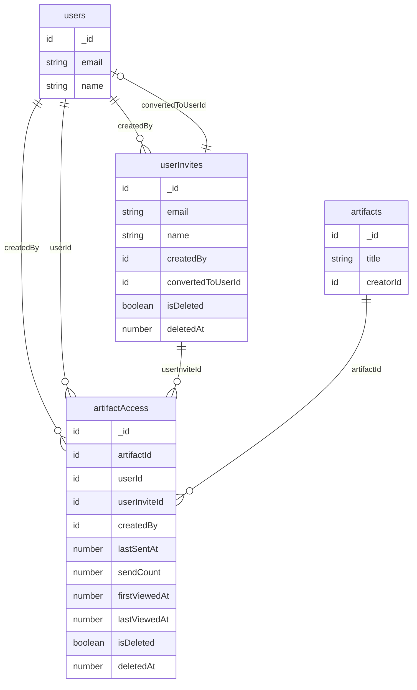
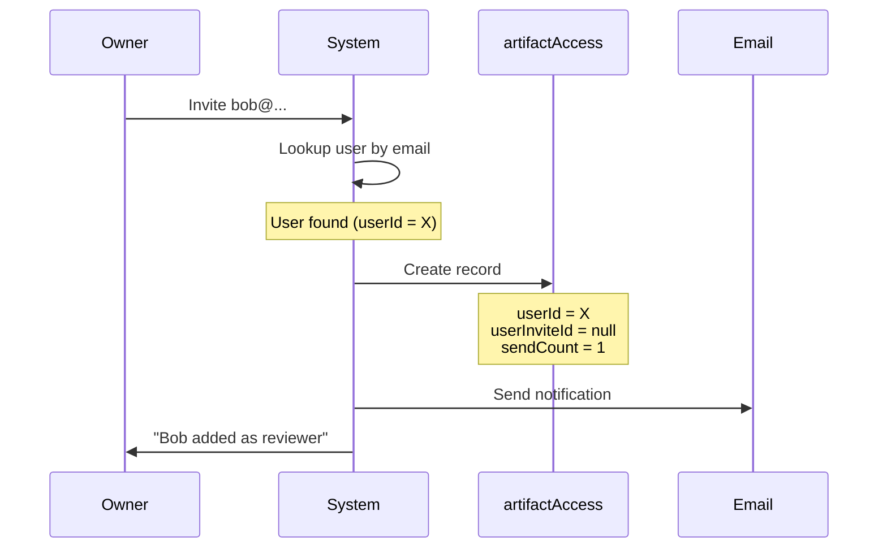
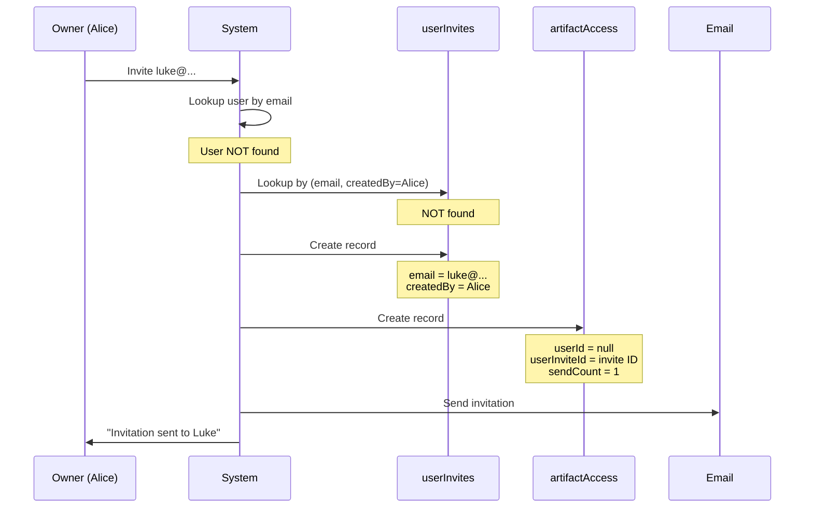
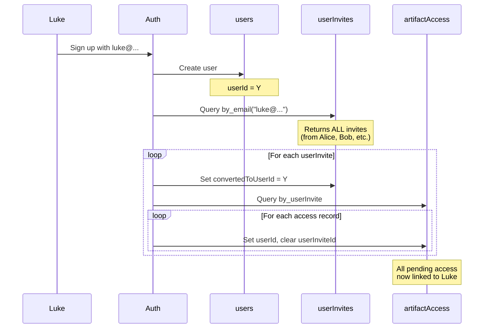
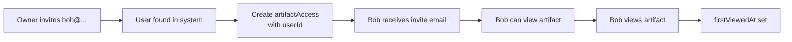
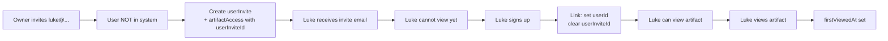
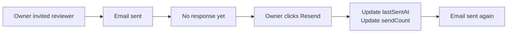
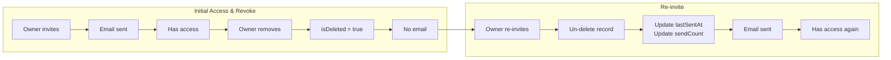
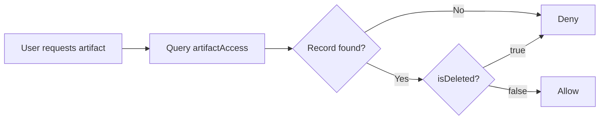

# Invitation & Access System Diagrams

## Entity Relationship

## Invite Flow: Existing User

## Invite Flow: New User

## Signup & Linking Flow

## Access Record Lifecycle

### Path 1: Invite Existing User (has account)

### Path 2: Invite New User (no account)

### Resend Invite

### Revoke & Re-invite

### State Summary

| State | Meaning | Data |
|-------|---------|------|
| **Pending** | Invited, no account yet, cannot view | `userInviteId` set, `userId` null |
| **Added** | Has account, can view & comment | `userId` set, `firstViewedAt` null |
| **Viewed** | Has actually opened the artifact | `userId` set, `firstViewedAt` set |
| **Removed** | Access removed by owner | `isDeleted` = true |

## Access Check (Critical Path)

## Data Examples

### Scenario: Alice invites Luke to 2 artifacts, Bob invites Luke to 1

**userInvites:**
| _id | email | createdBy | convertedToUserId |
|-----|-------|-----------|-------------------|
| ui1 | luke@... | Alice | null |
| ui2 | luke@... | Bob | null |

**artifactAccess:**
| _id | artifactId | userId | userInviteId | createdBy |
|-----|------------|--------|--------------|-----------|
| aa1 | Artifact A | null | ui1 | Alice |
| aa2 | Artifact B | null | ui1 | Alice |
| aa3 | Artifact C | null | ui2 | Bob |

### After Luke signs up (userId = Y):

**userInvites:**
| _id | email | createdBy | convertedToUserId |
|-----|-------|-----------|-------------------|
| ui1 | luke@... | Alice | **Y** |
| ui2 | luke@... | Bob | **Y** |

**artifactAccess:**
| _id | artifactId | userId | userInviteId | createdBy |
|-----|------------|--------|--------------|-----------|
| aa1 | Artifact A | **Y** | **null** | Alice |
| aa2 | Artifact B | **Y** | **null** | Alice |
| aa3 | Artifact C | **Y** | **null** | Bob |
