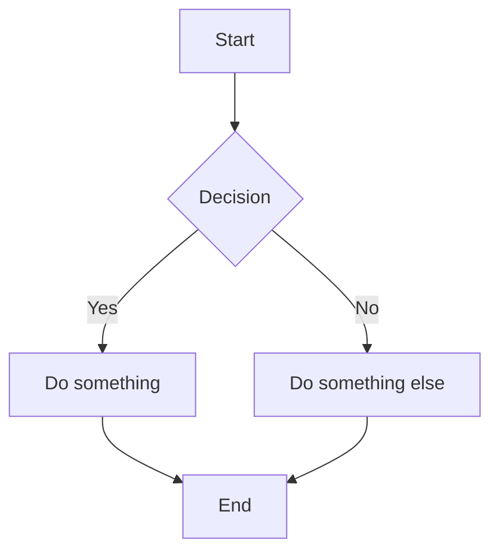
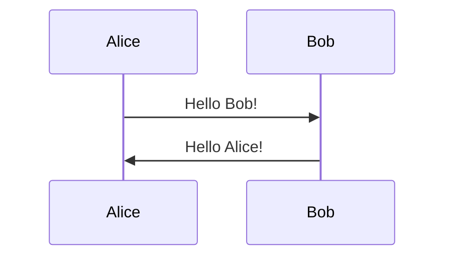

# Subtask 08: Implement Mermaid Lazy Loading (Phase 2)

**Parent Task:** 00027-md-file-viewing-support
**Status:** COMPLETE
**Last Updated:** 2026-01-06
**Phase:** 2

---

## Objective

Add Mermaid diagram support to the markdown renderer with lazy loading to avoid impacting bundle size for documents without diagrams.

---

## Background

From library research (Subtask 01):
- Mermaid.js is ~2.7MB (significant bundle impact)
- Must lazy-load only when diagrams are detected
- Graceful degradation: syntax errors show code block with error message

---

## Approach

### Detection Strategy

Before rendering, scan markdown content for Mermaid code blocks:

```typescript
const containsMermaid = (content: string): boolean => {
  return /```mermaid\n[\s\S]*?```/.test(content);
};
```

Only load Mermaid when diagrams are detected.

### Lazy Loading

Use dynamic import to load Mermaid only when needed:

```typescript
// Create a separate component for Mermaid diagrams
const MermaidDiagram = React.lazy(() => import('./MermaidDiagram'));

// In MarkdownViewer, conditionally render
{containsMermaid(content) && (
  <React.Suspense fallback={<DiagramSkeleton />}>
    {/* Render with Mermaid support */}
  </React.Suspense>
)}
```

### Custom Code Block Renderer

Override the code block component in react-markdown:

```tsx
<ReactMarkdown
  components={{
    code({ node, inline, className, children, ...props }) {
      const match = /language-(\w+)/.exec(className || '');
      const language = match ? match[1] : '';

      if (!inline && language === 'mermaid') {
        return <MermaidDiagram code={String(children)} />;
      }

      // Regular code block
      return <code className={className} {...props}>{children}</code>;
    },
  }}
>
```

---

## Requirements

### Installation

```bash
npm install mermaid
```

### MermaidDiagram Component

Create `app/src/components/artifact/MermaidDiagram.tsx`:

```typescript
interface MermaidDiagramProps {
  code: string;
}

export function MermaidDiagram({ code }: MermaidDiagramProps) {
  // Initialize mermaid
  // Render diagram to SVG
  // Handle errors gracefully
}
```

### Error Handling

When Mermaid syntax is invalid:
1. Show the original code block (fallback)
2. Display error message above/below
3. Log error for debugging

```tsx
<div className="border border-red-200 rounded bg-red-50 p-4">
  <p className="text-red-600 text-sm mb-2">Diagram syntax error: {error}</p>
  <pre className="bg-gray-100 p-2 rounded text-sm">{code}</pre>
</div>
```

### Loading State

While Mermaid is loading (lazy import):
- Show skeleton placeholder
- Maintain approximate diagram dimensions

---

## Files to Create/Modify

| File | Action |
|------|--------|
| `app/src/components/artifact/MermaidDiagram.tsx` | Create |
| `app/src/components/artifact/MarkdownViewer.tsx` | Modify |
| `app/package.json` | Add mermaid dependency |

---

## Testing

1. **No diagrams** - Mermaid should NOT be loaded
2. **Valid diagram** - Renders as SVG
3. **Invalid syntax** - Shows error with code fallback
4. **Multiple diagrams** - All render correctly
5. **Bundle size** - Verify Mermaid is in separate chunk

### Test Markdown

```markdown
# Document with Mermaid



## Sequence Diagram


```

---

## Bundle Size Verification

Check that Mermaid is code-split:

```bash
# Build and analyze
npm run build
# Check chunk sizes in output
```

Mermaid should be in a separate chunk that's only loaded when needed.

---

## Deliverables

- [x] `mermaid` package installed
- [ ] `MermaidDiagram` component created
- [ ] Mermaid loads lazily (verify with network tab)
- [ ] Valid diagrams render as SVG
- [ ] Invalid syntax shows graceful fallback
- [ ] Loading skeleton while Mermaid loads
- [ ] Unit tests for MermaidDiagram component

---

## Dependencies

- Subtask 07 must be complete (Phase 1 working)

---

## Notes

- Mermaid initialization should happen once per page
- Consider dark mode support (future)
- SVG output allows commenting on diagram elements (future enhancement)
