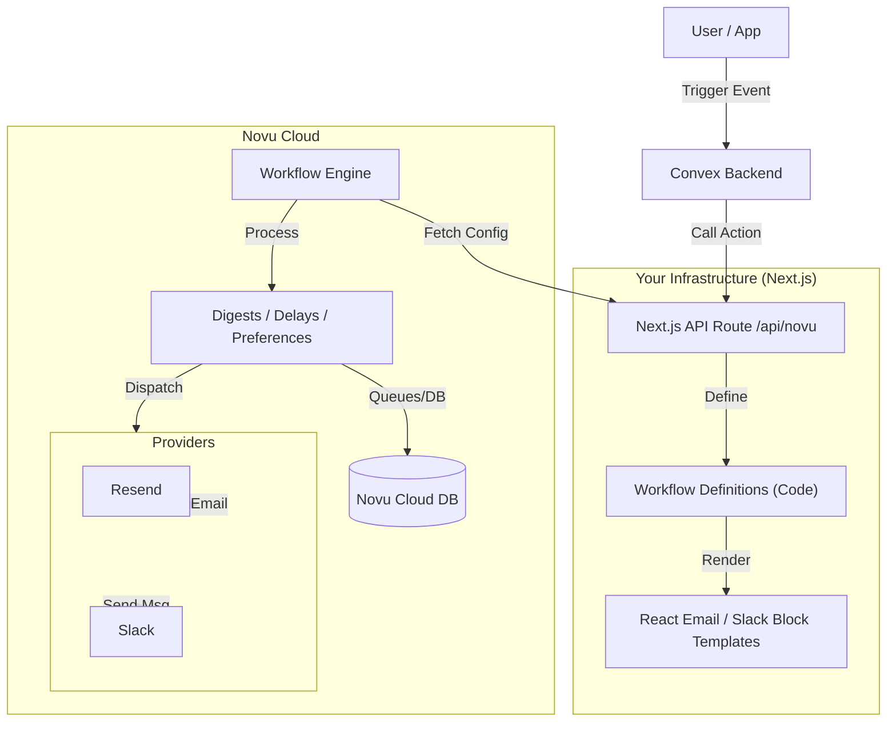

# Novu Integration Architecture

## System Overview

We are implementing the **Novu Framework (Bridge Architecture)**. This means our notification workflows are defined as code within our Next.js application, rather than being built and stored solely in the Novu Cloud dashboard.

### Component Diagram



---

## 2. Environments & lifecycle

We maintain strict separation between generic "Workflow Logic" (code) and "Runtime Configuration" (Novu Cloud).

### Free Tier Strategy (No Upgrade Required)
Novu's Free Tier includes **Development** and **Production** environments. We map our 3 application stages to these 2 Novu environments effectively.

| Application Stage | Next.js State | Novu Cloud Env | Triggers Sent To |
| :--- | :--- | :--- | :--- |
| **Local** | Localhost (`npm run dev`) | **Development** | Localhost Tunnel |
| **Hosted Dev** | Vercel Preview URL | **Development** | Vercel Preview URL |
| **Production** | Production URL | **Production** | Production URL |

**Implication**:
- Both "Local" and "Hosted Dev" share the same **Development** API Key.
- You do **not** need to pay $30/mo for a 3rd environment.
- Novu differentiates them by the **Bridge URL**:
    - When running locally, the bridge is your tunnel.
    - When running on Vercel Preview, the bridge is `https://project-git-branch.vercel.app/api/novu`.

---

## 3. Versioning & Migrations

Because we are using the **Bridge Architecture**, "migrations" in the traditional sense don't exist.

### Code-First Truth
- **Workflows**: Defined in TypeScript files (e.g., `comment-workflow.ts`).
- **Templates**: Defined as React components within those workflow files.
- **Versioning**: All of this lives in Git. If you checkout an old commit, you have the old workflows.

### Syncing
Novu Cloud doesn't store a static copy of your templates. Instead, it asks your API for them at runtime.
- **Dev/Preview**: When you deploy to Vercel Preview, Novu sees the code deployed there.
- **Production**: When you merge to `main` and deploy to Prod, Novu's Production environment automatically starts using the new code available at your production endpoint.

### Breaking Changes
If you rename a workflow ID (e.g., from `new-comment` to `comment-created`), you must update the trigger code in Convex simultaneously. Since both the trigger code and the workflow definition are in the same Git repo and deployed together, this is atomic.

---

## 4. State & Persistence (Digests, Delays)

You asked about **long-running jobs**. This is the key value of using a managed service (Novu Cloud).

### Responsibility Split
| Responsibility | Who Handles It? | Notes |
| :--- | :--- | :--- |
| **Workflow Logic** | **Your Code** | "If digest full, send email" |
| **Templates** | **Your Code** | React Email components |
| **State (Queues)** | **Novu Cloud** | Stores pending events for Digest |
| **Execution** | **Novu Cloud** | Runs the timers and workers |

### Example: Digest Workflow
1.  **Trigger**: User comments. Your app sends event to Novu Cloud.
2.  **Ingest (Cloud)**: Novu Cloud sees "Digest for 30 mins". It puts the event in its **Database**.
3.  **Wait (Cloud)**: Novu Cloud's workers wait 30 minutes. **Your app does nothing.**
4.  **Execute (Cloud)**: Timer finishes. Novu Cloud calls your `/api/novu` bridge: *"Render 'comment-workflow' with these 5 events."*
5.  **Send**: Your app returns the HTML. Novu Cloud inspects it and dispatches to Provider.

You do **not** need Redis, BullMQ, or background workers in your infrastructure. Novu Cloud handles the state.

---

## 5. Local Development Setup

To develop notifications locally without deploying, we use the **Novu CLI Studio**.

### The "Bridge" Tunnel
When you run the local studio, it creates a secure tunnel (like Ngrok) that allows Novu Cloud to "talk back" to your local machine to fetch templates.

**Command:**
```bash
npx novu@latest dev
```

**What happens:**
1.  Starts a local dashboard at `http://localhost:2022`.
2.  Connects to your `NOVU_SECRET_KEY` (Dev environment).
3.  Watches your `app/src/app/api/novu` directory for changes.
4.  Allows you to "Trigger" a notification from the UI and see it Render in real-time using your local code.

### Developer Workflow
1.  **Create**: Add a new workflow file (e.g., `comment-workflow.ts`).
2.  **Preview**: Open `localhost:2022`. The new workflow appears automatically.
3.  **Edit**: Change the email template in VS Code.
4.  **Verify**: The Studio updates instantly (Hot Reload for notifications).
5.  **Commit**: Push the `.ts` file to Git.

---

## 6. Deployment Strategy

### CI/CD Integration
Since workflows are code, they are deployed just like the rest of the application. However, Novu Cloud needs to know about them.

**Syncing:**
Users do **not** need to manually push workflows. When the Next.js app deploys to Vercel/Convex, the `/api/novu` endpoint becomes live. Novu Cloud automatically "discovers" the workflows when they are first triggered or sync actions are performed.

**Environment Variables**
- **Development**: Developers share a "Dev" environment key in `.env.local`.
- **Production**: The "Prod" API Key is set in Vercel/Convex environment variables.

### API Bridge Security
The `/api/novu` endpoint is public but secured:
- It requires the `NOVU_SECRET_KEY` in headers to authorize requests.
- Novu Cloud signs requests, and the SDK verifies the signature to ensure only Novu can execute your workflows.

---

## 7. CLI Integration
We use the Novu CLI primarily for the **Local Studio**. We do not use it for "deploying" static configurations, as the Bridge architecture is dynamic.

**Recommended `package.json` script:**
```json
"scripts": {
  "novu:dev": "novu dev"
}
```
