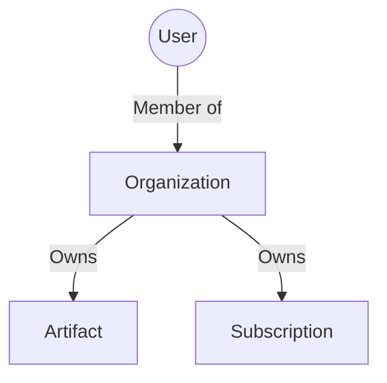

# Organizational Hierarchy Design

## Goal
Define the structural relationships between Users, Organizations, and Artifacts.

## Hierarchy (Simplified)

*   **Organization**: The billable entity. Owns artifacts and members.
*   **Artifact**: Belongs directly to an Organization (no Workspace layer).

## Deferred: Workspaces
**Decision:** Workspaces are **deferred** to avoid early scope creep.
*   Agent segregation will be handled at the Organization level for now.
*   Workspaces can be introduced later if needed for sub-organization grouping.

## Multi-Organization Support
**Decision: YES**, users can belong to multiple organizations.
*   Every user gets a default "Personal Organization".

## Agent Control (Organization-Level)
*   **Policy:** `allowAgents` (boolean) on the Organization.
*   If `false`: Agents are blocked from Write operations in this Org.
