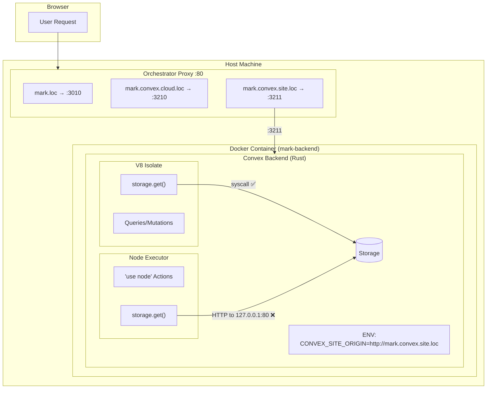
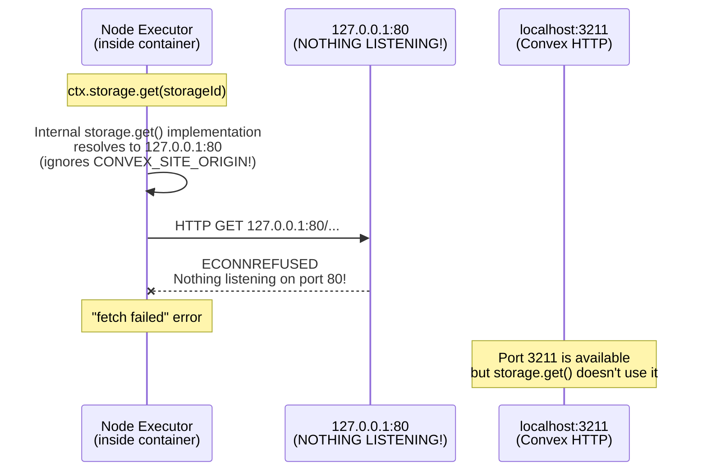
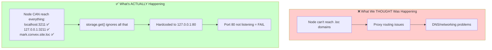
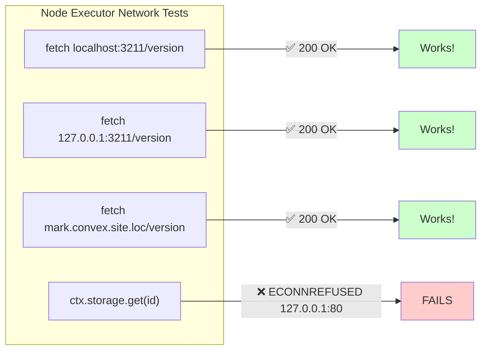
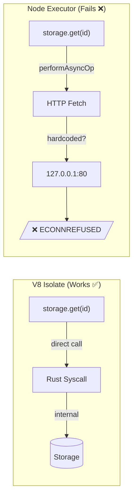
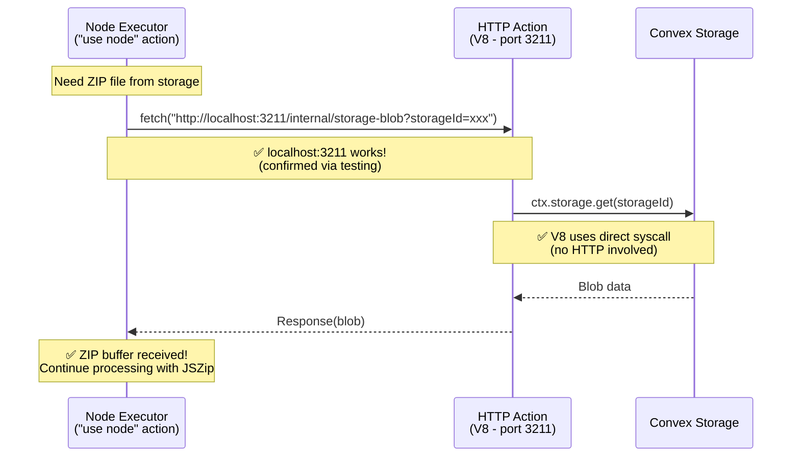
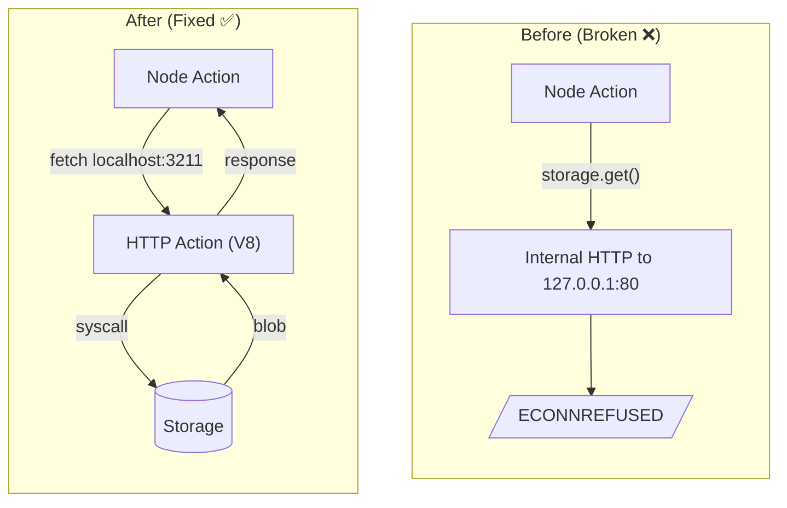
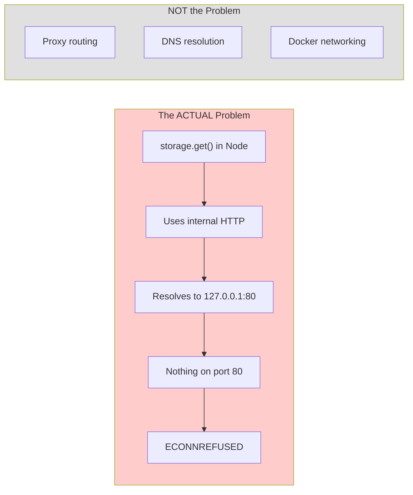

# Architecture Diagram: Node Action Storage Access Issue

> **Note**: This diagram has been updated based on diagnostic testing. See "What We Got Wrong" section below.

## Current Setup Overview

## The ACTUAL Problem (Confirmed via Testing)

## What We Got Wrong (Initial Assumptions vs Reality)

## Test Results That Proved This

## Why V8 Works But Node Fails

## The Fix: HTTP Action Intermediary

## Architecture Comparison

## Summary Table (Updated with Test Results)

| Component | URL/Method | Works? | Tested? | Notes |
|-----------|------------|:------:|:-------:|-------|
| Browser → Proxy | `mark.convex.site.loc:80` | ✅ | ✅ | Proxy routes correctly |
| V8 → Storage | Direct syscall | ✅ | ✅ | No HTTP involved |
| Node → localhost:3211 | `fetch()` | ✅ | ✅ | **Works!** |
| Node → 127.0.0.1:3211 | `fetch()` | ✅ | ✅ | **Works!** |
| Node → .loc domain | `fetch()` | ✅ | ✅ | **Works!** |
| Node → storage.get() | Internal HTTP | ❌ | ✅ | Hits 127.0.0.1:80 |

## Root Cause (Corrected)

**The proxy setup is NOT the issue. The issue is that `storage.get()` in Node actions internally tries to connect to `127.0.0.1:80`, which has nothing listening.**
